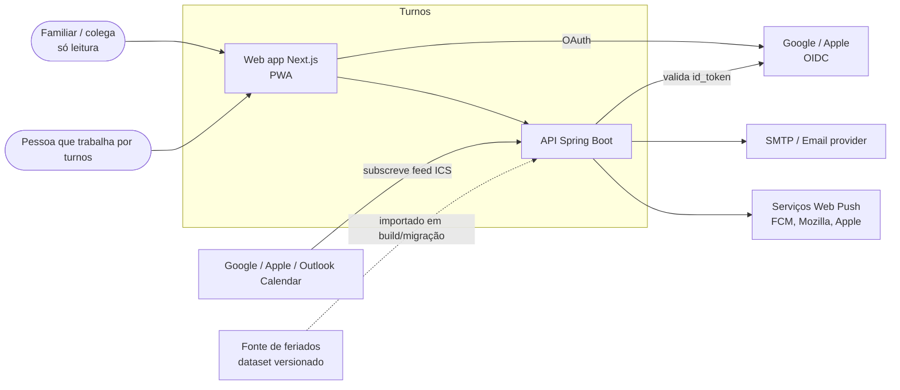
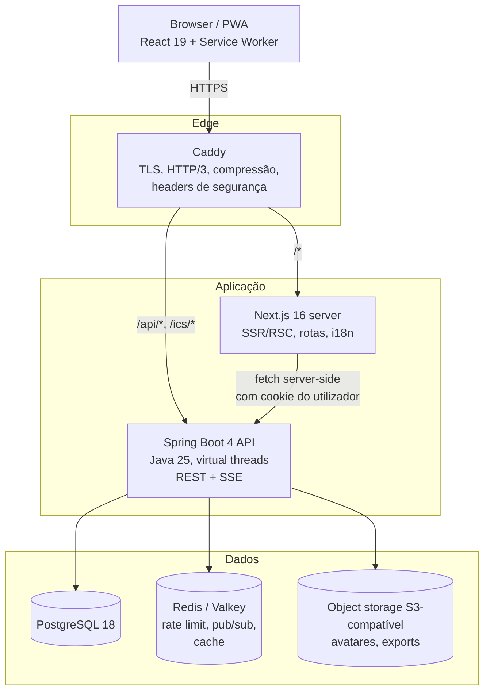
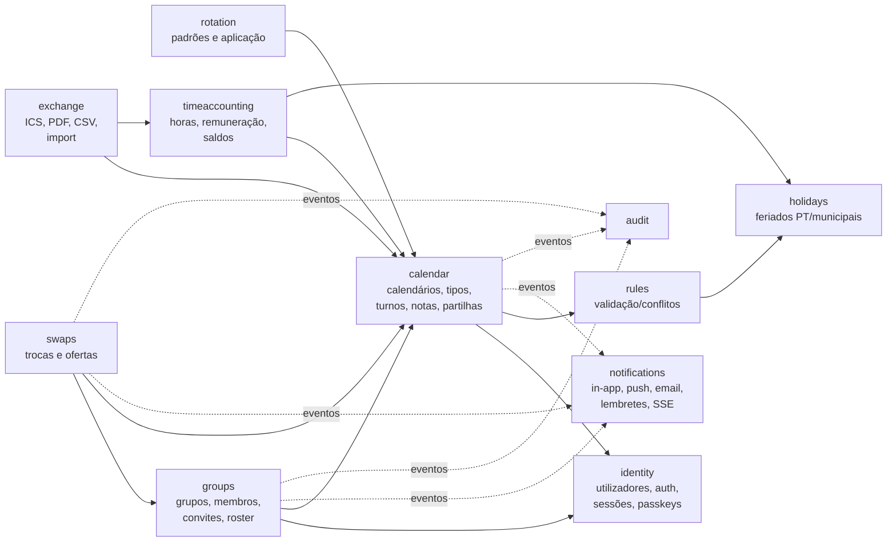
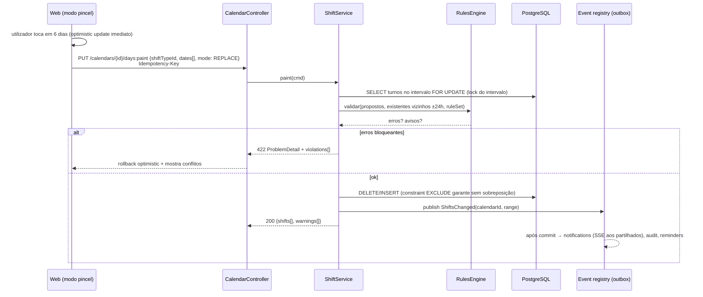
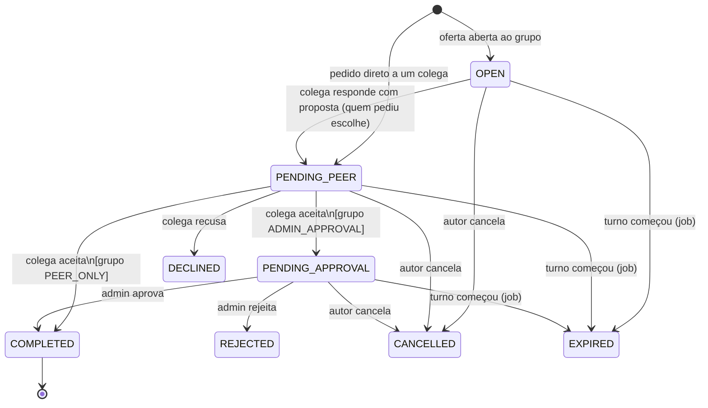

# 2. Arquitetura

## 2.1 Forças que moldam a arquitetura

| Força | Consequência |
|-------|--------------|
| Equipa pequena (1–3 devs), produto novo | **Monólito modular**, um deploy, uma BD. Nada de microserviços. |
| Domínio centrado em **tempo** (turnos noturnos, DST, feriados, rotações) | Modelo temporal explícito e testado; cálculos no backend, determinísticos. |
| Leituras ≫ escritas (consultar o mês vs. editar) | Consultas por intervalo muito otimizadas (índices GiST/BRIN), cache HTTP com ETag. |
| Invariantes que não podem falhar (sobreposição, trocas concorrentes) | Garantidos **na BD** (constraints + locking otimista), não apenas em código. |
| Notificações têm de chegar | **Outbox transacional**: evento gravado na mesma transação da alteração. |
| Mobile-first, rede instável | PWA com cache de leitura, mutações idempotentes (`Idempotency-Key`). |
| Frontend e backend em linguagens diferentes | **Contrato OpenAPI como fonte de verdade**, cliente TS gerado. |

## 2.2 Contexto (C4 nível 1)



## 2.3 Contentores (C4 nível 2)



**Pontos-chave**

- **Mesma origem** (`turnos.pt` e `turnos.pt/api`) — o Caddy encaminha por prefixo. Isto permite cookies `SameSite=Strict`,
  sem CORS em produção e sem tokens em `localStorage`.
- O **Next.js não tem lógica de negócio**: renderiza, faz *prefetch* server-side (RSC) e serve a PWA. Toda a regra vive na API.
  Isto mantém aberta a porta a uma app nativa (React Native) que fale diretamente com a mesma API.
- **Uma só instância** da API chega para milhares de utilizadores; está desenhada *stateless* (sessão = JWT + refresh em BD)
  para escalar horizontalmente quando for preciso — o único estado partilhado (SSE fan-out, rate limit) passa pelo Redis.

## 2.4 Stack

### Backend

| Área | Escolha | Porquê |
|------|---------|--------|
| Linguagem/runtime | **Java 25 LTS** | LTS atual; *virtual threads* estáveis, *records*, *pattern matching*, `sealed` para o domínio |
| Framework | **Spring Boot 4.x** (Spring Framework 7) | Ecossistema, segurança, observabilidade; Jakarta EE 11 |
| Modularidade | **Spring Modulith 2** | Fronteiras de módulo verificadas em teste, eventos entre módulos, *event publication registry* (outbox) |
| Concorrência | Spring MVC + **virtual threads** (`spring.threads.virtual.enabled=true`) | Modelo bloqueante simples com escalabilidade de I/O; evita WebFlux/reactive |
| Persistência | **Spring Data JPA (Hibernate 7)** para agregados + **jOOQ** ou `JdbcClient` para leituras/relatórios | JPA para escrita com invariantes; SQL explícito para consultas de intervalo e estatísticas |
| Migrações | **Flyway** | SQL puro versionado, revisto em PR |
| BD | **PostgreSQL 18** | `tstzrange` + `EXCLUDE USING gist`, `uuidv7()` nativo, JSONB, RLS, `citext` |
| Cache / mensagens | **Redis 7 / Valkey 8** | Rate limiting (Bucket4j), pub/sub para SSE multi-instância, cache de feriados/estatísticas |
| Jobs agendados | **db-scheduler** (tabela em Postgres) | Lembretes e expirações persistentes, *cluster-safe* sem infraestrutura extra |
| Validação | Jakarta Bean Validation + validação de domínio | Erros de formato vs. violações de regra de negócio |
| Mapeamento | **MapStruct** | DTO ↔ domínio em tempo de compilação, sem reflexão |
| API docs | **springdoc-openapi** (OpenAPI 3.1) | Contrato publicado em `/api/v3/api-docs`, gera cliente TS |
| Segurança | **Spring Security 7** | JWT (resource server) + refresh em cookie, OIDC para Google/Apple, WebAuthn |
| Password hashing | Argon2id (`Argon2PasswordEncoder`) | Recomendação OWASP atual |
| iCalendar | **ical4j** | Geração de feed ICS com `VTIMEZONE` correto |
| PDF | **OpenPDF** (ou Typst via CLI no v2) | Leve, licença LGPL/MPL |
| Web Push | `nl.martijndwars:web-push` (VAPID) | Mesmo protocolo que o EscalasPT já usa |
| Email | Spring Mail + templates **JTE** | Templates type-safe |
| Observabilidade | Micrometer + **OpenTelemetry** (OTLP), logs JSON (logstash-encoder) | Métricas, traces e logs correlacionados |
| Build | **Gradle (Kotlin DSL)** + version catalog; imagem com **Jib** ou Buildpacks | Builds reprodutíveis, imagens *distroless* sem Dockerfile |
| Testes | JUnit 5, AssertJ, **Testcontainers** (Postgres/Redis reais), Spring Modulith `ApplicationModuleTest`, **ArchUnit**, REST Assured | Testar contra Postgres real — as constraints fazem parte da lógica |

### Frontend

| Área | Escolha | Porquê |
|------|---------|--------|
| Framework | **Next.js 16 (App Router)** + React 19 + TypeScript *strict* | Layouts aninhados, RSC para *first paint* rápido, rotas i18n, landing page SEO no mesmo projeto |
| Estado de servidor | **TanStack Query v5** | Cache, *optimistic updates*, invalidação por eventos SSE |
| Estado de UI | **Zustand** (pouco) + estado na URL (`nuqs`) | Vista/data/calendário ativos na URL = partilhável e com "voltar" a funcionar |
| Cliente API | **openapi-typescript** + **openapi-fetch** | Tipos gerados do contrato; erro de compilação quando a API muda |
| UI | **Tailwind CSS v4** + **shadcn/ui** (Radix primitives) | Acessibilidade de base (foco, ARIA), componentes nossos (não uma dependência opaca) |
| Calendário | **Componentes próprios** (month grid, time grid, roster) sobre `date-fns` + `@date-fns/tz`; `@dnd-kit` para arrastar | O modo pincel e o roster (pessoas × dias) não se fazem bem com FullCalendar; a vista *resource timeline* deste é paga |
| Formulários | react-hook-form + **zod** | Validação partilhável entre cliente e *server actions* |
| i18n | **next-intl** | Mensagens ICU, formatação de datas/números por locale |
| Gráficos | Recharts | Estatísticas simples |
| PWA | **Serwist** | Service worker, cache offline, *push* |
| Testes | Vitest + Testing Library, **MSW** para mocks da API, **Playwright** E2E, Storybook para o design system | |
| Qualidade | ESLint (flat config), Prettier, `tsc --noEmit`, `knip` (código morto) | |

## 2.5 Módulos do backend (monólito modular)

Cada módulo é um pacote de topo em `pt.turnos.<modulo>` com API pública mínima (`<modulo>` + `<modulo>.api`)
e internos em `<modulo>.internal`. O Spring Modulith falha o build se um módulo aceder a internos de outro.



Setas cheias = chamada síncrona a API pública. Setas tracejadas = **eventos de domínio** publicados com
`ApplicationEventPublisher` e consumidos com `@ApplicationModuleListener` (assíncrono, após *commit*, persistido no
*event publication registry* — se o consumidor falhar, é re-tentado).

| Módulo | Responsabilidade | Agregados |
|--------|------------------|-----------|
| `identity` | Registo, login, refresh, OIDC, TOTP, passkeys, sessões, perfil, RGPD (export/delete) | `User`, `Session`, `Credential` |
| `calendar` | Calendários, partilhas, tipos de turno, turnos, notas de dia | `Calendar` (raiz), `ShiftType`, `Shift`, `DayNote`, `CalendarShare` |
| `rotation` | Definir rotações, pré-visualizar, aplicar/reaplicar a intervalos | `Rotation`, `RotationApplication` |
| `rules` | Motor de validação (sobreposição, dia inteiro, descanso, máx. horas) — puro, sem I/O próprio | `RuleSet` (config do calendário) |
| `holidays` | Catálogo de feriados por país/região/concelho, feriados móveis (Páscoa) | `Holiday` |
| `timeaccounting` | Horas, segmentação noturna/feriado, remuneração, banco de horas, saldos de ausências | `PayProfile`, `AbsenceAllowance` |
| `groups` | Grupos, convites, membros, papéis, partilha de calendário com o grupo, roster | `Group`, `Membership`, `Invite` |
| `swaps` | Pedidos de troca, ofertas abertas, respostas, aprovação, aplicação atómica | `SwapRequest` |
| `notifications` | Centro de notificações, preferências, push, email, lembretes, stream SSE | `Notification`, `PushSubscription`, `Preference` |
| `exchange` | Feed ICS, export PDF/CSV, import | `IcsFeed` |
| `audit` | Registo imutável de atividade | `AuditEvent` |
| `shared` (não é módulo) | Tipos transversais: `Money`, `LocalTimeRange`, `ZonedInterval`, `Clock`, `ProblemDetail` helpers | — |

### Arquitetura interna de um módulo

Arquitetura em camadas "pragmática" (hexagonal leve), sem cerimónia desnecessária:

```
pt.turnos.calendar
├── CalendarApi.java              ← fachada pública (usada por outros módulos)
├── events/                       ← eventos publicados (records): ShiftsChanged, ShiftDeleted…
├── web/                          ← @RestController, DTOs (records), mappers MapStruct
├── internal/
│   ├── domain/                   ← entidades JPA + lógica (métodos com invariantes, sem setters públicos)
│   ├── app/                      ← serviços de aplicação (@Transactional, orquestração, autorização)
│   ├── persistence/              ← repositórios Spring Data + queries jOOQ/JdbcClient
│   └── config/
└── package-info.java             ← @ApplicationModule(allowedDependencies = {"identity", "rules", …})
```

Regras:
- Controllers **não** tocam em repositórios; serviços de aplicação sim.
- Entidades expõem **comportamento** (`shift.reschedule(...)`, `swap.accept(by)`), não *setters*.
- DTOs de API são `record`s separados das entidades (nunca serializar entidades JPA).
- Tempo sempre via `java.time.Clock` injetado — testes determinísticos.

## 2.6 Modelo temporal (o coração do domínio)

Erros de tempo são a classe de bug mais provável numa app de turnos. Regras:

1. **Cada calendário tem um fuso IANA** (`Europe/Lisbon`, `Atlantic/Azores`, `Atlantic/Madeira`).
2. Um turno é definido pelo utilizador em **tempo local**: `data` + `hora de início` + `duração`.
   - A duração é explícita (não "hora de fim"), por isso um turno de 22:00 com 8 h termina às 06:00 do dia seguinte sem ambiguidade.
3. A partir disso, o backend calcula `starts_at`/`ends_at` em **UTC (`timestamptz`)** usando o fuso do calendário:
   - Na noite de mudança para a hora de verão (01:00→02:00 em Lisboa), um turno 22:00 + 8 h termina às **07:00** locais
     (8 h reais). Se o tipo for "até às 06:00 fixo" (`end_rule = WALL_CLOCK`), fica com 7 h reais. Ambos suportados, por tipo.
   - Horas locais inexistentes (gap) são deslocadas para a frente; horas repetidas (overlap) usam o primeiro offset.
4. O **dia de referência** de um turno (`local_date`) é o dia em que começa — é onde aparece no calendário mensal.
5. As consultas por período usam **intervalos semiabertos** `[início, fim)` sobre `tstzrange`.
6. Horas noturnas/feriado são calculadas **segmentando** o intervalo real do turno nas fronteiras relevantes
   (ex.: 22:00–07:00 noturno; 00:00 de um feriado), em tempo local do calendário.

Tipos Java no `shared`:

```java
public record ShiftTiming(LocalDate localDate, LocalTime start, Duration duration, EndRule endRule) {
    public ZonedInterval resolve(ZoneId zone) { ... }   // aplica regras de DST
}
public record ZonedInterval(Instant start, Instant end) { ... } // [start, end)
```

## 2.7 Fluxos principais

### 2.7.1 Pintar dias (modo pincel) — escrita em lote



### 2.7.2 Troca de turno (máquina de estados)

> **Escalas GNR:** substituído pelo fluxo sem comandante em [9. Trocas GNR](09-trocas-gnr.md#93-máquina-de-estados)
> (`PENDENTE → EM_ESPERA → ACEITE`, PDF emitido na aceitação). O diagrama abaixo é o modelo genérico para grupos que não são GNR.



A transição para `COMPLETED` é **uma única transação**:
1. `SELECT … FOR UPDATE` nos dois turnos e no pedido (ordem determinística por id → sem *deadlocks*).
2. Verifica `version` (locking otimista) — se algum turno mudou desde o pedido, falha com `409 Conflict`.
3. Valida regras para **ambos** os calendários com os turnos trocados (descanso, sobreposição…).
4. Move os turnos (`calendar_id` trocado; `source = SWAP`, `swap_request_id` preenchido).
5. Cancela automaticamente outros pedidos pendentes que envolvam esses turnos.
6. Publica `SwapCompleted` → notificações, auditoria, PDF comprovativo on-demand.

### 2.7.3 Lembretes

- Ao gravar um turno com lembretes (herdados do tipo), o módulo `notifications` agenda tarefas no **db-scheduler**
  (`reminder:{shiftId}:{offset}`), com execução em `starts_at - offset`.
- Alterar/apagar o turno re-agenda/cancela (o id da tarefa é determinístico → idempotente).
- Só se agenda uma janela de 14 dias à frente; um job diário alimenta a janela (evita milhões de tarefas para rotações de um ano).

## 2.8 Tempo real

- **SSE** (`GET /api/v1/stream`, `text/event-stream`) em vez de WebSocket: o fluxo é só servidor→cliente,
  funciona sobre HTTP/2/3 sem *upgrade*, reconecta sozinho com `Last-Event-ID`, e passa por proxies sem configuração.
- Com virtual threads, cada ligação SSE aberta custa ~KB, não uma *platform thread*.
- **Fan-out multi-instância**: a instância que processa o evento publica em Redis (`turnos:user:{id}`); cada instância
  subscreve os canais dos utilizadores que tem ligados. Com uma só instância, é um *bus* em memória (mesma interface).
- Eventos enviados são **pequenos** (tipo + ids + intervalo). O cliente invalida as *queries* TanStack correspondentes
  e volta a buscar — o servidor nunca empurra estado que o cliente teria de fundir.

```text
event: shifts.changed
id: 01J9Z…
data: {"calendarId":"…","from":"2026-10-01","to":"2026-10-31"}
```

## 2.9 Consistência, concorrência e idempotência

| Problema | Mecanismo |
|----------|-----------|
| Dois dispositivos editam o mesmo turno | `@Version` (locking otimista) → `409` com o estado atual; UI oferece "manter o meu / usar o do servidor" |
| Sobreposição de turnos em corrida | `EXCLUDE USING gist (calendar_id WITH =, time_range WITH &&)` — impossível na BD |
| Duas pessoas aceitam a mesma oferta | `SELECT … FOR UPDATE` no pedido + transição de estado validada |
| Retry do cliente após timeout (rede móvel) | Header `Idempotency-Key` em POST/PUT de lote; resposta guardada 24 h (tabela `idempotency_keys`) |
| Notificação perdida se o processo cair | Event publication registry do Spring Modulith (outbox na mesma transação) |
| Push enviado duas vezes | Chave de deduplicação por (`notification_id`, `subscription_id`) |

## 2.10 Desempenho e escalabilidade

- **Leitura do mês**: 1 query (`time_range && tstzrange(:from,:to)`) com índice GiST composto; resposta com `ETag`
  (hash da `max(updated_at)` + contagem) → `304 Not Modified` na maioria dos *refetch*.
- **Roster de grupo**: query única agregada por membro/dia, respeitando o nível de detalhe partilhado; cache Redis 60 s
  invalidada por eventos `ShiftsChanged` de qualquer membro.
- **Estatísticas**: calculadas em SQL (segmentação por fronteiras) para intervalos grandes; *materialized view* por mês
  se o volume o exigir.
- **Orçamento**: 1 vCPU / 1 GB para a API servem confortavelmente ~5–10 mil utilizadores ativos. Escala horizontal = mais réplicas
  atrás do Caddy (sessões são *stateless*; SSE via Redis; jobs via db-scheduler com *locking* na BD).

## 2.11 Estrutura do repositório (monorepo)

```
turnos/
├── apps/
│   ├── api/                         # Spring Boot (Gradle)
│   │   ├── src/main/java/pt/turnos/{identity,calendar,rotation,rules,holidays,
│   │   │                            timeaccounting,groups,swaps,notifications,exchange,audit,shared}
│   │   ├── src/main/resources/db/migration/   # Flyway V1__…sql
│   │   └── src/test/java/…          # unit, módulo (Modulith), integração (Testcontainers), arquitetura (ArchUnit)
│   └── web/                         # Next.js
│       ├── src/app/…                # rotas (ver doc 05)
│       ├── src/features/…           # calendar, rotations, groups, swaps, stats, settings
│       ├── src/components/ui/…      # design system (shadcn)
│       └── src/lib/api/schema.d.ts  # GERADO a partir do OpenAPI
├── packages/
│   └── design-tokens/               # tokens (cores, espaçamento) → CSS vars + Tailwind theme
├── contracts/openapi.yaml           # snapshot do contrato versionado (diff revisto em PR)
├── infra/
│   ├── compose.yaml                 # dev: postgres, redis, mailpit, api, web
│   ├── compose.prod.yaml
│   └── Caddyfile
├── docs/                            # estes documentos + ADRs
└── .github/workflows/               # ci-api.yml, ci-web.yml, contract.yml, e2e.yml, security.yml
```

**Fluxo do contrato**: a API gera `openapi.yaml` num teste (`./gradlew generateOpenApi`) → é *commitado* em `contracts/` →
o CI falha se o ficheiro gerado divergir do *commitado* → `pnpm --filter web gen:api` gera os tipos TS.
Assim, qualquer alteração da API aparece como *diff* legível no PR e parte a compilação do frontend onde for incompatível.
