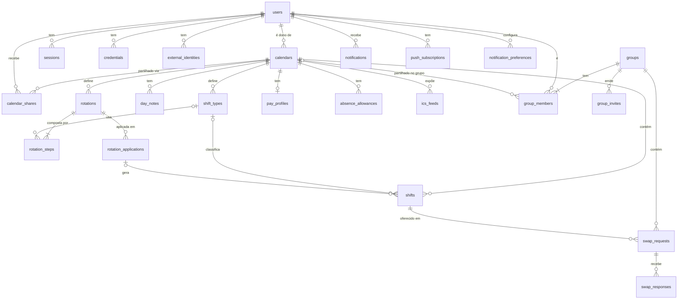

# 3. Modelo de dados

## 3.1 Princípios

- **Identificadores**: `uuid` v7 (`uuidv7()` nativo no PostgreSQL 18) — ordenáveis no tempo, bons para índices B-tree,
  não expõem contagens como um `bigserial` exporia.
- **Tempo**: `timestamptz` para instantes; `date`/`time` para valores locais definidos pelo utilizador; o fuso do calendário
  é a ponte entre ambos (ver [2.6](02-arquitetura.md#26-modelo-temporal-o-coração-do-domínio)).
- **Invariantes na BD**: `CHECK`, `UNIQUE` parciais, `EXCLUDE`, `FOREIGN KEY` com `ON DELETE` explícito.
- **Enums** como `text` + `CHECK` (evolui com uma migração simples; os `ENUM` nativos do Postgres são rígidos a alterar).
- **Auditoria** em tabela própria, *append-only* (sem `UPDATE`/`DELETE` para o utilizador da aplicação).
- **Sem soft-delete genérico**: turnos apagados desaparecem (a auditoria guarda o antes); contas usam anonimização (RGPD).
- Colunas comuns: `created_at timestamptz not null default now()`, `updated_at` mantido pela aplicação, `version int` para locking otimista nos agregados editáveis.

## 3.2 Diagrama entidade-relação



## 3.3 DDL (Flyway `V1__baseline.sql`, versão de desenho)

```sql
CREATE EXTENSION IF NOT EXISTS citext;
CREATE EXTENSION IF NOT EXISTS btree_gist;   -- igualdade de uuid dentro de EXCLUDE USING gist

-- ─────────────────────────── identity ───────────────────────────
CREATE TABLE users (
    id                uuid PRIMARY KEY DEFAULT uuidv7(),
    email             citext NOT NULL UNIQUE,
    email_verified_at timestamptz,
    password_hash     text,                           -- null se só usa OIDC/passkeys
    display_name      text NOT NULL CHECK (length(display_name) BETWEEN 1 AND 100),
    avatar_key        text,                           -- chave no object storage
    locale            text NOT NULL DEFAULT 'pt-PT',
    time_zone         text NOT NULL DEFAULT 'Europe/Lisbon',
    week_starts_on    smallint NOT NULL DEFAULT 1 CHECK (week_starts_on BETWEEN 1 AND 7), -- ISO: 1 = segunda
    totp_secret_enc   bytea,                          -- cifrado (AES-GCM, chave fora da BD)
    failed_logins     int NOT NULL DEFAULT 0,
    locked_until      timestamptz,
    status            text NOT NULL DEFAULT 'ACTIVE' CHECK (status IN ('ACTIVE','DISABLED','ANONYMIZED')),
    created_at        timestamptz NOT NULL DEFAULT now(),
    updated_at        timestamptz NOT NULL DEFAULT now()
);

CREATE TABLE external_identities (             -- Google / Apple (OIDC)
    user_id    uuid NOT NULL REFERENCES users(id) ON DELETE CASCADE,
    provider   text NOT NULL CHECK (provider IN ('GOOGLE','APPLE')),
    subject    text NOT NULL,
    created_at timestamptz NOT NULL DEFAULT now(),
    PRIMARY KEY (provider, subject)
);

CREATE TABLE credentials (                     -- passkeys (WebAuthn)
    id              uuid PRIMARY KEY DEFAULT uuidv7(),
    user_id         uuid NOT NULL REFERENCES users(id) ON DELETE CASCADE,
    credential_id   bytea NOT NULL UNIQUE,
    public_key_cose bytea NOT NULL,
    sign_count      bigint NOT NULL DEFAULT 0,
    label           text,
    created_at      timestamptz NOT NULL DEFAULT now(),
    last_used_at    timestamptz
);

CREATE TABLE sessions (                        -- uma por dispositivo; refresh tokens rodam dentro da sessão
    id                 uuid PRIMARY KEY DEFAULT uuidv7(),
    user_id            uuid NOT NULL REFERENCES users(id) ON DELETE CASCADE,
    refresh_hash       bytea NOT NULL UNIQUE,      -- SHA-256 do refresh token atual
    previous_hash      bytea,                      -- deteção de reutilização (token roubado)
    user_agent         text,
    ip                 inet,
    created_at         timestamptz NOT NULL DEFAULT now(),
    last_seen_at       timestamptz NOT NULL DEFAULT now(),
    expires_at         timestamptz NOT NULL,
    revoked_at         timestamptz
);
CREATE INDEX ON sessions (user_id) WHERE revoked_at IS NULL;

CREATE TABLE email_tokens (                    -- verificação de email, reset de password
    token_hash bytea PRIMARY KEY,
    user_id    uuid NOT NULL REFERENCES users(id) ON DELETE CASCADE,
    purpose    text NOT NULL CHECK (purpose IN ('VERIFY_EMAIL','RESET_PASSWORD','CHANGE_EMAIL')),
    payload    jsonb,
    expires_at timestamptz NOT NULL,
    used_at    timestamptz
);

-- ─────────────────────────── calendar ───────────────────────────
CREATE TABLE calendars (
    id                 uuid PRIMARY KEY DEFAULT uuidv7(),
    owner_id           uuid NOT NULL REFERENCES users(id) ON DELETE CASCADE,
    name               text NOT NULL CHECK (length(name) BETWEEN 1 AND 60),
    color              text NOT NULL DEFAULT '#2563EB' CHECK (color ~ '^#[0-9A-Fa-f]{6}$'),
    time_zone          text NOT NULL,              -- IANA; validado na aplicação (ZoneId.of)
    country_code       char(2) NOT NULL DEFAULT 'PT',
    region_code        text,                       -- ex.: 'PT-20' (Açores)
    municipality_code  text,                       -- código DICOFRE do concelho, p/ feriado municipal
    rules              jsonb NOT NULL DEFAULT '{"minRestHours":11,"fullDayExclusive":true,"maxWeeklyHours":null}',
    position           int NOT NULL DEFAULT 0,
    archived_at        timestamptz,
    version            int NOT NULL DEFAULT 0,
    created_at         timestamptz NOT NULL DEFAULT now(),
    updated_at         timestamptz NOT NULL DEFAULT now()
);
CREATE INDEX ON calendars (owner_id);

CREATE TABLE calendar_shares (                 -- partilha direta com outra conta
    calendar_id uuid NOT NULL REFERENCES calendars(id) ON DELETE CASCADE,
    user_id     uuid NOT NULL REFERENCES users(id) ON DELETE CASCADE,
    permission  text NOT NULL CHECK (permission IN ('AVAILABILITY','VIEW','EDIT')),
    created_at  timestamptz NOT NULL DEFAULT now(),
    PRIMARY KEY (calendar_id, user_id)
);

CREATE TABLE shift_types (
    id                uuid PRIMARY KEY DEFAULT uuidv7(),
    calendar_id       uuid NOT NULL REFERENCES calendars(id) ON DELETE CASCADE,
    name              text NOT NULL CHECK (length(name) BETWEEN 1 AND 40),
    abbreviation      text NOT NULL CHECK (length(abbreviation) BETWEEN 1 AND 4),
    color             text NOT NULL CHECK (color ~ '^#[0-9A-Fa-f]{6}$'),
    icon              text,                        -- nome de ícone (lucide)
    kind              text NOT NULL CHECK (kind IN ('WORK','ON_CALL','OFF','ABSENCE')),
    all_day           boolean NOT NULL DEFAULT false,
    start_time        time,                        -- null se all_day
    duration_minutes  int CHECK (duration_minutes BETWEEN 1 AND 2880),
    end_rule          text NOT NULL DEFAULT 'ELAPSED' CHECK (end_rule IN ('ELAPSED','WALL_CLOCK')),
    break_minutes     int NOT NULL DEFAULT 0 CHECK (break_minutes >= 0),
    counts_as_work    boolean NOT NULL DEFAULT true,  -- conta para horas trabalhadas
    pay_multiplier    numeric(5,2) NOT NULL DEFAULT 1.00,
    reminder_offsets  int[] NOT NULL DEFAULT '{}',    -- minutos antes do início, ex.: {60, 720}
    position          int NOT NULL DEFAULT 0,
    archived_at       timestamptz,                    -- arquivado: não aparece no pincel, turnos antigos mantêm-no
    version           int NOT NULL DEFAULT 0,
    created_at        timestamptz NOT NULL DEFAULT now(),
    updated_at        timestamptz NOT NULL DEFAULT now(),
    CHECK ( (all_day AND start_time IS NULL AND duration_minutes IS NULL)
         OR (NOT all_day AND start_time IS NOT NULL AND duration_minutes IS NOT NULL) )
);
CREATE UNIQUE INDEX shift_types_abbrev_uq ON shift_types (calendar_id, lower(abbreviation)) WHERE archived_at IS NULL;

CREATE TABLE rotations (
    id                uuid PRIMARY KEY DEFAULT uuidv7(),
    calendar_id       uuid NOT NULL REFERENCES calendars(id) ON DELETE CASCADE,
    name              text NOT NULL,
    cycle_length_days int NOT NULL CHECK (cycle_length_days BETWEEN 1 AND 366),
    version           int NOT NULL DEFAULT 0,
    created_at        timestamptz NOT NULL DEFAULT now(),
    updated_at        timestamptz NOT NULL DEFAULT now()
);

CREATE TABLE rotation_steps (                   -- dia i do ciclo → tipo (ou vazio = nada)
    rotation_id   uuid NOT NULL REFERENCES rotations(id) ON DELETE CASCADE,
    day_index     int  NOT NULL CHECK (day_index >= 0),
    shift_type_id uuid REFERENCES shift_types(id) ON DELETE RESTRICT,
    PRIMARY KEY (rotation_id, day_index)
);

CREATE TABLE rotation_applications (
    id           uuid PRIMARY KEY DEFAULT uuidv7(),
    rotation_id  uuid NOT NULL REFERENCES rotations(id) ON DELETE CASCADE,
    calendar_id  uuid NOT NULL REFERENCES calendars(id) ON DELETE CASCADE,
    start_date   date NOT NULL,
    end_date     date NOT NULL,                     -- inclusive
    start_offset int  NOT NULL DEFAULT 0,           -- "começa no dia X do ciclo"
    created_at   timestamptz NOT NULL DEFAULT now(),
    CHECK (end_date >= start_date),
    CHECK (end_date - start_date <= 731)            -- no máximo ~2 anos de cada vez
);

CREATE TABLE shifts (
    id                       uuid PRIMARY KEY DEFAULT uuidv7(),
    calendar_id              uuid NOT NULL REFERENCES calendars(id) ON DELETE CASCADE,
    shift_type_id            uuid REFERENCES shift_types(id) ON DELETE SET NULL,
    local_date               date NOT NULL,           -- dia de referência (dia de início)
    all_day                  boolean NOT NULL DEFAULT false,
    local_start              time,                    -- tal como definido pelo utilizador
    duration_minutes         int,
    starts_at                timestamptz NOT NULL,    -- resolvido com o fuso do calendário
    ends_at                  timestamptz NOT NULL,
    time_range               tstzrange GENERATED ALWAYS AS (tstzrange(starts_at, ends_at, '[)')) STORED,
    title                    text,                    -- override do nome do tipo
    color                    text CHECK (color IS NULL OR color ~ '^#[0-9A-Fa-f]{6}$'),
    notes                    text CHECK (length(notes) <= 2000),
    break_minutes            int NOT NULL DEFAULT 0,
    overtime_minutes         int NOT NULL DEFAULT 0,
    pay_multiplier           numeric(5,2),            -- override do tipo
    source                   text NOT NULL DEFAULT 'MANUAL' CHECK (source IN ('MANUAL','PAINT','ROTATION','SWAP','IMPORT')),
    rotation_application_id  uuid REFERENCES rotation_applications(id) ON DELETE SET NULL,
    is_override              boolean NOT NULL DEFAULT false,  -- editado à mão depois de gerado por rotação
    swap_request_id          uuid,                    -- FK adicionada depois de swap_requests
    version                  int NOT NULL DEFAULT 0,
    created_at               timestamptz NOT NULL DEFAULT now(),
    updated_at               timestamptz NOT NULL DEFAULT now(),
    CHECK (ends_at > starts_at),
    -- Invariante central: nunca dois turnos com hora a sobrepor-se no mesmo calendário
    CONSTRAINT shifts_no_overlap EXCLUDE USING gist (calendar_id WITH =, time_range WITH &&) WHERE (NOT all_day)
);
CREATE INDEX shifts_cal_date_idx  ON shifts (calendar_id, local_date);
CREATE INDEX shifts_range_idx     ON shifts USING gist (calendar_id, time_range);  -- consultas por intervalo
CREATE INDEX shifts_rotation_idx  ON shifts (rotation_application_id) WHERE rotation_application_id IS NOT NULL;
-- Dia inteiro (férias, folga…): no máximo um por dia
CREATE UNIQUE INDEX shifts_one_allday_per_day ON shifts (calendar_id, local_date) WHERE all_day;

CREATE TABLE day_notes (
    calendar_id uuid NOT NULL REFERENCES calendars(id) ON DELETE CASCADE,
    local_date  date NOT NULL,
    text        text NOT NULL CHECK (length(text) BETWEEN 1 AND 1000),
    tags        text[] NOT NULL DEFAULT '{}',
    updated_at  timestamptz NOT NULL DEFAULT now(),
    PRIMARY KEY (calendar_id, local_date)
);

-- ─────────────────────────── holidays ───────────────────────────
CREATE TABLE holidays (
    id                uuid PRIMARY KEY DEFAULT uuidv7(),
    country_code      char(2) NOT NULL,
    region_code       text,
    municipality_code text,
    date              date NOT NULL,
    name              text NOT NULL,
    kind              text NOT NULL CHECK (kind IN ('NATIONAL','REGIONAL','MUNICIPAL','OPTIONAL')),
    UNIQUE NULLS NOT DISTINCT (country_code, region_code, municipality_code, date)
);
CREATE INDEX ON holidays (country_code, date);

CREATE TABLE calendar_custom_holidays (
    calendar_id uuid NOT NULL REFERENCES calendars(id) ON DELETE CASCADE,
    date        date NOT NULL,
    name        text NOT NULL,
    PRIMARY KEY (calendar_id, date)
);

-- ─────────────────────────── timeaccounting ───────────────────────────
CREATE TABLE pay_profiles (
    calendar_id           uuid PRIMARY KEY REFERENCES calendars(id) ON DELETE CASCADE,
    currency              char(3) NOT NULL DEFAULT 'EUR',
    base_hourly_rate      numeric(10,2) NOT NULL CHECK (base_hourly_rate >= 0),
    night_start           time NOT NULL DEFAULT '22:00',
    night_end             time NOT NULL DEFAULT '07:00',
    night_premium_pct     numeric(5,2) NOT NULL DEFAULT 25,
    weekend_premium_pct   numeric(5,2) NOT NULL DEFAULT 0,
    holiday_premium_pct   numeric(5,2) NOT NULL DEFAULT 100,
    overtime_premium_pct  numeric(5,2) NOT NULL DEFAULT 25,
    monthly_target_hours  numeric(6,2),              -- banco de horas
    updated_at            timestamptz NOT NULL DEFAULT now()
);

CREATE TABLE absence_allowances (
    calendar_id   uuid NOT NULL REFERENCES calendars(id) ON DELETE CASCADE,
    shift_type_id uuid NOT NULL REFERENCES shift_types(id) ON DELETE CASCADE,
    year          int  NOT NULL,
    days          numeric(5,1) NOT NULL CHECK (days >= 0),
    carried_over  numeric(5,1) NOT NULL DEFAULT 0,
    PRIMARY KEY (calendar_id, shift_type_id, year)
);

-- ─────────────────────────── groups ───────────────────────────
CREATE TABLE groups (
    id            uuid PRIMARY KEY DEFAULT uuidv7(),
    name          text NOT NULL CHECK (length(name) BETWEEN 1 AND 80),
    description   text,
    color         text NOT NULL DEFAULT '#7C3AED',
    swap_policy   text NOT NULL DEFAULT 'PEER_ONLY' CHECK (swap_policy IN ('PEER_ONLY','ADMIN_APPROVAL','DISABLED')),
    time_zone     text NOT NULL DEFAULT 'Europe/Lisbon',
    created_by    uuid REFERENCES users(id) ON DELETE SET NULL,
    version       int NOT NULL DEFAULT 0,
    created_at    timestamptz NOT NULL DEFAULT now(),
    updated_at    timestamptz NOT NULL DEFAULT now()
);

CREATE TABLE group_members (
    group_id           uuid NOT NULL REFERENCES groups(id) ON DELETE CASCADE,
    user_id            uuid NOT NULL REFERENCES users(id) ON DELETE CASCADE,
    role               text NOT NULL CHECK (role IN ('OWNER','ADMIN','MEMBER')),
    shared_calendar_id uuid REFERENCES calendars(id) ON DELETE SET NULL,
    share_level        text NOT NULL DEFAULT 'DETAILS' CHECK (share_level IN ('AVAILABILITY','DETAILS')),
    nickname           text,
    joined_at          timestamptz NOT NULL DEFAULT now(),
    PRIMARY KEY (group_id, user_id)
);
CREATE INDEX ON group_members (user_id);
CREATE UNIQUE INDEX group_one_owner ON group_members (group_id) WHERE role = 'OWNER';

CREATE TABLE group_invites (
    id          uuid PRIMARY KEY DEFAULT uuidv7(),
    group_id    uuid NOT NULL REFERENCES groups(id) ON DELETE CASCADE,
    token_hash  bytea NOT NULL UNIQUE,               -- link /join/{token}; só o hash fica na BD
    email       citext,                              -- null = link reutilizável
    role        text NOT NULL DEFAULT 'MEMBER' CHECK (role IN ('ADMIN','MEMBER')),
    max_uses    int,
    uses        int NOT NULL DEFAULT 0,
    expires_at  timestamptz NOT NULL,
    created_by  uuid REFERENCES users(id) ON DELETE SET NULL,
    revoked_at  timestamptz
);

-- ─────────────────────────── swaps ───────────────────────────
-- Escalas GNR: ver a migração do doc 09 (§9.8): estados PENDENTE/EM_ESPERA/ACEITE/…, sem decided_by, + swap_documents.
CREATE TABLE swap_requests (
    id                 uuid PRIMARY KEY DEFAULT uuidv7(),
    group_id           uuid NOT NULL REFERENCES groups(id) ON DELETE CASCADE,
    kind               text NOT NULL CHECK (kind IN ('SWAP','GIVEAWAY')),
    requester_id       uuid NOT NULL REFERENCES users(id) ON DELETE CASCADE,
    requester_shift_id uuid NOT NULL REFERENCES shifts(id) ON DELETE CASCADE,
    target_user_id     uuid REFERENCES users(id) ON DELETE CASCADE,   -- null = oferta aberta ao grupo
    target_shift_id    uuid REFERENCES shifts(id) ON DELETE CASCADE,
    status             text NOT NULL CHECK (status IN
                         ('OPEN','PENDING_PEER','PENDING_APPROVAL','COMPLETED','DECLINED','REJECTED','CANCELLED','EXPIRED')),
    message            text CHECK (length(message) <= 500),
    expires_at         timestamptz NOT NULL,          -- = starts_at do turno mais cedo envolvido
    decided_by         uuid REFERENCES users(id) ON DELETE SET NULL,
    decided_at         timestamptz,
    completed_at       timestamptz,
    version            int NOT NULL DEFAULT 0,
    created_at         timestamptz NOT NULL DEFAULT now(),
    updated_at         timestamptz NOT NULL DEFAULT now(),
    CHECK (kind = 'GIVEAWAY' OR status = 'OPEN' OR target_shift_id IS NOT NULL)
);
-- um turno só pode estar num pedido ativo de cada vez
CREATE UNIQUE INDEX swap_one_active_per_shift ON swap_requests (requester_shift_id)
    WHERE status IN ('OPEN','PENDING_PEER','PENDING_APPROVAL');
CREATE INDEX ON swap_requests (group_id, status);
CREATE INDEX ON swap_requests (target_user_id) WHERE status = 'PENDING_PEER';
CREATE INDEX ON swap_requests (expires_at) WHERE status IN ('OPEN','PENDING_PEER','PENDING_APPROVAL');

CREATE TABLE swap_responses (                        -- respostas a ofertas abertas
    id               uuid PRIMARY KEY DEFAULT uuidv7(),
    swap_request_id  uuid NOT NULL REFERENCES swap_requests(id) ON DELETE CASCADE,
    responder_id     uuid NOT NULL REFERENCES users(id) ON DELETE CASCADE,
    offered_shift_id uuid REFERENCES shifts(id) ON DELETE CASCADE,  -- null em GIVEAWAY ("eu fico com ele")
    status           text NOT NULL CHECK (status IN ('PROPOSED','CHOSEN','WITHDRAWN','DISCARDED')),
    created_at       timestamptz NOT NULL DEFAULT now(),
    UNIQUE (swap_request_id, responder_id)
);

ALTER TABLE shifts ADD CONSTRAINT shifts_swap_fk
    FOREIGN KEY (swap_request_id) REFERENCES swap_requests(id) ON DELETE SET NULL;

-- ─────────────────────────── notifications ───────────────────────────
CREATE TABLE notifications (
    id          uuid PRIMARY KEY DEFAULT uuidv7(),
    user_id     uuid NOT NULL REFERENCES users(id) ON DELETE CASCADE,
    type        text NOT NULL,                        -- ex.: SWAP_REQUESTED, SHIFT_REMINDER, GROUP_INVITE
    payload     jsonb NOT NULL,                       -- ids e dados para a UI renderizar (i18n no cliente)
    read_at     timestamptz,
    created_at  timestamptz NOT NULL DEFAULT now()
);
CREATE INDEX ON notifications (user_id, created_at DESC);
CREATE INDEX ON notifications (user_id) WHERE read_at IS NULL;

CREATE TABLE notification_preferences (
    user_id  uuid NOT NULL REFERENCES users(id) ON DELETE CASCADE,
    type     text NOT NULL,
    channels text[] NOT NULL,                         -- {'IN_APP','PUSH','EMAIL'}
    PRIMARY KEY (user_id, type)
);

CREATE TABLE push_subscriptions (
    id          uuid PRIMARY KEY DEFAULT uuidv7(),
    user_id     uuid NOT NULL REFERENCES users(id) ON DELETE CASCADE,
    session_id  uuid REFERENCES sessions(id) ON DELETE CASCADE,
    endpoint    text NOT NULL UNIQUE,
    p256dh      text NOT NULL,
    auth        text NOT NULL,
    created_at  timestamptz NOT NULL DEFAULT now(),
    last_ok_at  timestamptz,
    failures    int NOT NULL DEFAULT 0                 -- remove após 410 Gone ou N falhas
);

-- ─────────────────────────── exchange ───────────────────────────
CREATE TABLE ics_feeds (
    id           uuid PRIMARY KEY DEFAULT uuidv7(),
    calendar_id  uuid NOT NULL REFERENCES calendars(id) ON DELETE CASCADE,
    token_hash   bytea NOT NULL UNIQUE,               -- o token só é mostrado ao utilizador uma vez
    detail       text NOT NULL DEFAULT 'DETAILS' CHECK (detail IN ('AVAILABILITY','DETAILS')),
    created_at   timestamptz NOT NULL DEFAULT now(),
    last_fetched_at timestamptz,
    revoked_at   timestamptz
);

-- ─────────────────────────── transversal ───────────────────────────
CREATE TABLE audit_events (
    id            uuid PRIMARY KEY DEFAULT uuidv7(),
    occurred_at   timestamptz NOT NULL DEFAULT now(),
    actor_id      uuid,                                -- sem FK: sobrevive à anonimização
    scope_type    text NOT NULL CHECK (scope_type IN ('USER','CALENDAR','GROUP','SYSTEM')),
    scope_id      uuid,
    action        text NOT NULL,                       -- ex.: shift.painted, swap.completed
    entity_type   text NOT NULL,
    entity_id     uuid,
    before        jsonb,
    after         jsonb,
    ip            inet,
    request_id    text
);
CREATE INDEX ON audit_events (scope_type, scope_id, occurred_at DESC);
-- REVOKE UPDATE, DELETE ON audit_events FROM turnos_app;   (ver doc 06)

CREATE TABLE idempotency_keys (
    user_id      uuid NOT NULL,
    key          text NOT NULL,
    request_hash bytea NOT NULL,                        -- mesmo key + body diferente → 422
    status_code  int NOT NULL,
    response     jsonb,
    created_at   timestamptz NOT NULL DEFAULT now(),
    PRIMARY KEY (user_id, key)
);

-- Tabelas geridas por bibliotecas (criadas nas suas migrações):
--   event_publication   (Spring Modulith — outbox de eventos entre módulos)
--   scheduled_tasks     (db-scheduler — lembretes, expiração de trocas, limpeza)
```

## 3.4 Decisões de modelação explicadas

### Porque é que os turnos são *materializados* (e não expandidos a partir da rotação em tempo de leitura)?

| Opção | Prós | Contras |
|-------|------|---------|
| **A. Materializar** (1 linha por turno) ✅ | Consultas simples e rápidas; constraints da BD aplicam-se; trocas, notas, extra e lembretes por turno são triviais; ICS/estatísticas são SQL direto | Aplicar rotação de 2 anos = ~730 linhas (irrelevante para o Postgres); reaplicar exige *merge* |
| B. Expandir em leitura (RRULE) | Pouco armazenamento; alterar rotação muda o futuro todo | Cada exceção vira caso especial; impossível ter `EXCLUDE`; estatísticas e trocas complicadas; bugs de DST em leitura |

Com A, a ligação à origem mantém-se (`rotation_application_id`, `is_override`). **Reaplicar** uma rotação:
apaga turnos da aplicação que **não** sejam `is_override` no intervalo, gera os novos, e devolve ao utilizador
a lista de *overrides* preservados para confirmação.

### Tipos de turno configuráveis em vez de códigos fixos

O EscalasPT tinha `_FULLDAY_CODES = {"F","FER","CONV",…}` e `_GRAT_CODES = {"GRAT"}` no código. Aqui a semântica vem de campos:

| Antes (código) | Agora (dados) |
|----------------|---------------|
| `code in _FULLDAY_CODES` | `all_day = true` (+ `kind IN ('OFF','ABSENCE')`) |
| `GRAT` acumulável com serviço normal | Qualquer tipo `WORK` sem sobreposição horária é acumulável; a regra "1 serviço normal por dia" passa a opcional no `rules` do calendário |
| `is_absence` | `kind = 'ABSENCE'` (conta para saldos) |
| `min_staff` (por posto) | Sai — não há planeamento centralizado (pode voltar como "cobertura mínima" de grupo, ver roadmap) |

### Snapshot de campos no turno

`break_minutes`, `pay_multiplier`, `title`, `color` podem ser *override* por turno; se nulos, herdam do tipo.
`starts_at/ends_at` são **sempre** gravados (snapshot), por isso editar o horário de um tipo **não altera turnos passados**
— a UI pergunta "aplicar a turnos futuros deste tipo?" e isso é uma operação explícita em lote.

### Autorização a nível de dados

Acesso a um calendário = `owner_id = :me`
∪ `calendar_shares(user_id = :me)`
∪ calendário partilhado num grupo onde `:me` é membro (`group_members.shared_calendar_id`, com o `share_level`).
Implementado numa única função SQL/consulta `accessible_calendars(:me)` reutilizada pelas leituras, e
num `CalendarAccessPolicy` no código para as escritas (ver doc 06).

## 3.5 Consultas críticas (esboço)

```sql
-- Mês de um calendário (vista mensal), inclui turnos que começam no mês anterior e entram neste
SELECT s.*, t.name, t.abbreviation, t.color AS type_color, t.kind
FROM shifts s
LEFT JOIN shift_types t ON t.id = s.shift_type_id
WHERE s.calendar_id = :calendarId
  AND s.time_range && tstzrange(:fromInstant, :toInstant, '[)')
ORDER BY s.starts_at;

-- Roster de grupo: membros × dias, respeitando o nível de detalhe
SELECT gm.user_id, s.local_date,
       CASE WHEN gm.share_level = 'DETAILS' THEN t.abbreviation END AS abbreviation,
       CASE WHEN gm.share_level = 'DETAILS' THEN coalesce(s.color, t.color) END AS color,
       t.kind, s.starts_at, s.ends_at
FROM group_members gm
JOIN shifts s ON s.calendar_id = gm.shared_calendar_id
LEFT JOIN shift_types t ON t.id = s.shift_type_id
WHERE gm.group_id = :groupId
  AND s.local_date BETWEEN :from AND :to;

-- Horas noturnas de um turno: interseção com as janelas noturnas locais (feito em Java por clareza e testabilidade;
-- em SQL apenas para agregados anuais grandes).
```

## 3.6 Política de retenção

| Dados | Retenção |
|-------|----------|
| Turnos, notas | Enquanto a conta existir |
| Notificações | 90 dias (job de limpeza) |
| Sessões revogadas/expiradas | 30 dias |
| `idempotency_keys` | 24 h |
| `audit_events` | 2 anos; eventos de conta anonimizada perdem `ip` e dados pessoais em `before/after` |
| `event_publication` concluídos | 7 dias |
