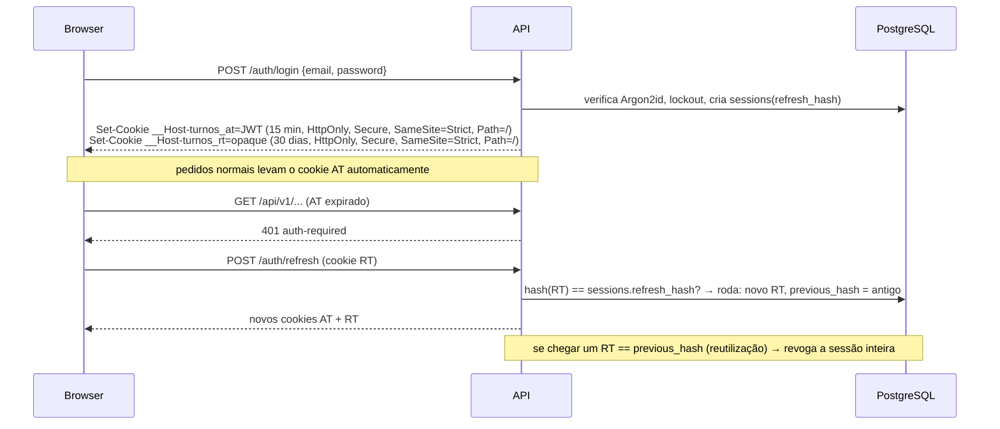
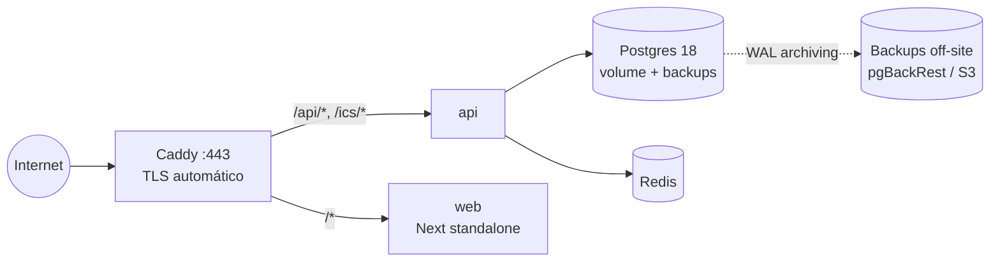

# 6. Segurança & operações

## 6.1 Autenticação

### Tokens e sessões



| Decisão | Detalhe |
|---------|---------|
| Access token | JWT **EdDSA (Ed25519)** assinado pela API, 15 min, *claims* mínimas: `sub`, `sid` (sessão), `iat`, `exp`, `amr` |
| Revogação imediata | `sid` verificado contra cache Redis de sessões revogadas (TTL = 15 min) — sem ida à BD por pedido |
| Refresh token | Opaco, 256 bits, só o SHA-256 na BD, rotação a cada uso, deteção de reutilização |
| Cookies | Prefixo `__Host-` (obriga `Secure`, `Path=/`, sem `Domain`) — o RT fica restrito ao endpoint de refresh pelo servidor, que o ignora noutros *paths* |
| Password | Argon2id (m=19 MiB, t=2, p=1), mínimo 10 caracteres, verificação contra lista de passwords comprometidas (k-anonymity HIBP, opcional) |
| Brute force | Rate limit por IP e por conta (Bucket4j/Redis) + lockout progressivo (herdado do EscalasPT) |
| MFA | TOTP (segredo cifrado AES-256-GCM com chave de ambiente) e **passkeys** (WebAuthn, `webauthn4j` via Spring Security) |
| OIDC | Google/Apple com PKCE + `state` + `nonce`; ligação a conta existente só com email verificado em ambos os lados |
| Sessões | Lista de dispositivos, revogar individual/todas, máximo configurável por utilizador |

### CSRF

Com cookies `SameSite=Strict` e mesma origem, o CSRF clássico já está mitigado. Defesa em profundidade:
- Todos os métodos não seguros exigem o header `X-Requested-With: turnos` (um formulário *cross-site* não o consegue enviar
  sem *preflight* CORS, e o CORS está fechado).
- Verificação de `Origin`/`Sec-Fetch-Site` no filtro de segurança.

## 6.2 Autorização

Modelo por **posse e relação**, não por papéis globais (não há "comandante"):

| Recurso | Ler | Escrever |
|---------|-----|----------|
| Calendário (e tipos, turnos, notas, rotações) | dono · share `VIEW`/`EDIT` · membro de grupo onde está partilhado (com `share_level`) | dono · share `EDIT` |
| Partilhas, feeds ICS, perfil remuneratório | dono | dono |
| Grupo | membros | `OWNER`/`ADMIN` (definições, convites, remover membros); `OWNER` (apagar, transferir) |
| Troca | envolvidos · membros do grupo (ofertas abertas) · admins | transições conforme a máquina de estados e o papel |
| Admin de sistema | — | Papel global `SYSTEM_ADMIN` apenas para operação (suporte, bloqueios); **não** vê calendários |

Implementação:
- `@PreAuthorize("@calendarAccess.canEdit(#calId, authentication)")` nos serviços de aplicação (não apenas nos controllers).
- `CalendarAccessPolicy` com cache por pedido (evita repetir a consulta de acesso no mesmo pedido).
- Respostas de acesso negado a recursos que o utilizador não pode ver devolvem **404**, não 403 (não revelar existência).
- **Testes de autorização gerados**: para cada endpoint, uma matriz (dono, partilhado VIEW, partilhado EDIT, membro de grupo,
  estranho, anónimo) × resultado esperado — corre em CI.
- Defesa em profundidade opcional (v1.1): **Row-Level Security** no Postgres com `SET LOCAL app.user_id` por transação,
  como o EscalasPT já fazia (`007_add_rls_policies.py`).

## 6.3 Privacidade e RGPD

- **Minimização**: não há NIP/NIM, número de ordem, morada ou telefone obrigatórios. Email + nome de apresentação.
- Horários de trabalho podem revelar rotinas (quando a casa está vazia) → partilha **sempre opt-in**, nível `AVAILABILITY` disponível,
  tokens ICS revogáveis, aviso claro ao criar um link.
- Direitos: exportação completa (JSON + ICS + CSV num ZIP), apagamento (anonimização da conta, remoção de turnos e
  calendários, saída dos grupos; eventos de auditoria mantêm só `actor_id` pseudónimo).
- Alojamento na UE; subprocessadores (email, push) listados na política de privacidade.
- Logs **sem** dados pessoais em claro (ids sim, emails/IPs mascarados ao fim de 30 dias).

## 6.4 Segurança da aplicação (checklist)

| Área | Medida |
|------|--------|
| Headers | CSP estrita com *nonces* (Next.js middleware), `Strict-Transport-Security`, `X-Content-Type-Options`, `Referrer-Policy: strict-origin-when-cross-origin`, `Permissions-Policy`, `frame-ancestors 'none'` |
| Input | Bean Validation em todos os DTOs; limites de tamanho de *body* (1 MB; imports 5 MB); `dates[]` do pincel ≤ 366 |
| SQL | Apenas *queries* parametrizadas (JPA/jOOQ/JdbcClient) |
| Uploads | Avatares: validação de tipo real (magic bytes), re-encode para WebP, tamanho máx.; guardados em S3 com nomes aleatórios |
| Segredos | Variáveis de ambiente / Docker secrets; nunca no repositório; *secret scanning* no CI |
| Dependências | Renovate/Dependabot, **OWASP Dependency-Check** (Java), `pnpm audit`, **Trivy** nas imagens, SBOM CycloneDX anexado a cada release |
| Imagens | Distroless / Chainguard, utilizador não-root, *read-only filesystem* |
| BD | Utilizador da aplicação sem `DDL`; `REVOKE UPDATE, DELETE ON audit_events`; migrações correm com outro utilizador |
| Tokens públicos | ICS e convites: 256 bits aleatórios, só hash na BD, comparação em tempo constante, rate limit por token |
| SAST | CodeQL (Java + TS) e Semgrep no CI |

## 6.5 Observabilidade

| Sinal | Ferramenta | Conteúdo |
|-------|------------|----------|
| Logs | JSON (logstash-logback-encoder) → Loki (ou só `docker logs` no início) | `requestId`, `userId` (hash), `traceId`, módulo |
| Métricas | Micrometer → Prometheus → Grafana | RED por endpoint, *pool* de ligações, `event_publication` pendentes, lag do db-scheduler, ligações SSE, entregas push OK/falhadas |
| Traces | OpenTelemetry (agente Java ou Micrometer Tracing) → Tempo/Jaeger | Browser → Next → API → BD |
| Erros frontend | Sentry (ou GlitchTip self-hosted) | Com *source maps*, sem PII |
| Uptime | Healthchecks externos (ex.: Uptime Kuma) a `/actuator/health/readiness` e a um feed ICS sintético | |

**SLOs iniciais**: disponibilidade 99,5% mensal; p95 leitura do mês < 200 ms; entrega de lembrete ≤ 60 s após a hora agendada em 99% dos casos.

Alertas: taxa de 5xx > 1% (5 min), eventos pendentes no outbox > 100 (10 min), jobs em atraso > 2 min, disco da BD > 80%.

## 6.6 Ambientes e deploy

| Ambiente | Onde | Notas |
|----------|------|-------|
| `local` | `docker compose up` (postgres, redis, mailpit, api com *devtools*, web com `next dev`) | Seeds com dados de exemplo (2 utilizadores, 1 grupo, rotações) |
| `preview` | Por PR (opcional): imagem com tag do SHA num VPS/Fly/Render | Base de dados efémera com seeds |
| `staging` | Mesmo *compose* que produção, dados sintéticos | Deploy automático a partir de `main` |
| `production` | VPS na UE com Docker Compose + **Caddy** (reutiliza a infraestrutura atual do EscalasPT) | Deploy por *tag* `v*` com aprovação manual |



- **Migrações**: Flyway corre num *init container*/passo de deploy antes de a nova versão da API arrancar;
  migrações sempre **retrocompatíveis** com a versão anterior (padrão *expand → migrate → contract*) para permitir *rollback* do código.
- **Backups**: `pgBackRest` com *full* semanal + incrementais diários + WAL contínuo → RPO ≤ 5 min, RTO ≤ 1 h.
  **Teste de restauro mensal automatizado** (restaura num contentor e corre verificações).
- **Zero downtime**: com uma réplica, `docker compose up -d --no-deps api` + *readiness probe* no Caddy (`health_uri`);
  com duas réplicas, *rolling*.

## 6.7 CI/CD (GitHub Actions)

| Workflow | Gatilho | Passos |
|----------|---------|--------|
| `ci-api.yml` | PR / push que toque `apps/api/**` | `./gradlew check` (compila, Spotless, testes unitários + Modulith + ArchUnit + integração Testcontainers), cobertura JaCoCo, gera OpenAPI e compara com `contracts/` |
| `ci-web.yml` | PR / push que toque `apps/web/**` ou `contracts/**` | `pnpm install --frozen-lockfile`, `gen:api`, `typecheck`, `lint`, `test`, `build` |
| `contract.yml` | PR que toque `contracts/**` | `oasdiff breaking` vs. `main` |
| `e2e.yml` | PR para `main` (e *nightly*) | `docker compose` da stack + seeds → Playwright (Chromium + WebKit mobile) + axe |
| `security.yml` | PR + semanal | CodeQL, Dependency-Check, `pnpm audit`, Trivy, gitleaks (evolução do `security.yml` atual) |
| `release.yml` | Tag `v*` | Build de imagens (Jib + Next standalone), SBOM, assinatura cosign, push para GHCR, deploy staging → aprovação → produção |

Política de branches: `main` protegida, PRs pequenos, *squash merge*, Conventional Commits (gera *changelog*).

## 6.8 Estratégia de testes do backend

```
            ▲  E2E (Playwright, poucos, fio condutor)
           ▲▲▲  Integração HTTP (REST Assured + Testcontainers: Postgres, Redis) — cada endpoint, matriz de autorização
         ▲▲▲▲▲  Módulo (Spring Modulith @ApplicationModuleTest, eventos entre módulos com Scenario API)
      ▲▲▲▲▲▲▲▲  Unitário (domínio puro: regras, tempo/DST, rotações, cálculo de horas/dinheiro, máquina de estados das trocas)
```

Casos obrigatórios (tabelas de teste parametrizadas):
- Turnos em **29 mar 2026** e **25 out 2026** (Lisboa) e equivalentes nos **Açores** (fuso diferente, mesma data de mudança).
- Turno que atravessa **31 dez → 1 jan** e **feriado móvel** (Sexta-feira Santa, Corpo de Deus).
- Rotação com ciclo de 10 dias aplicada a 2 anos, reaplicada com *overrides* no meio.
- Duas trocas concorrentes sobre o mesmo turno (teste com duas threads + `CountDownLatch`) → exatamente uma `COMPLETED`.
- `Idempotency-Key` repetida com o mesmo e com outro *body*.
- *Property-based testing* (jqwik) para o cálculo de horas: soma dos segmentos = duração real, para qualquer turno/fuso.

Arquitetura verificada em teste:
```java
@Test void modulesRespectBoundaries() {
    ApplicationModules.of(TurnosApplication.class).verify();
}
```
