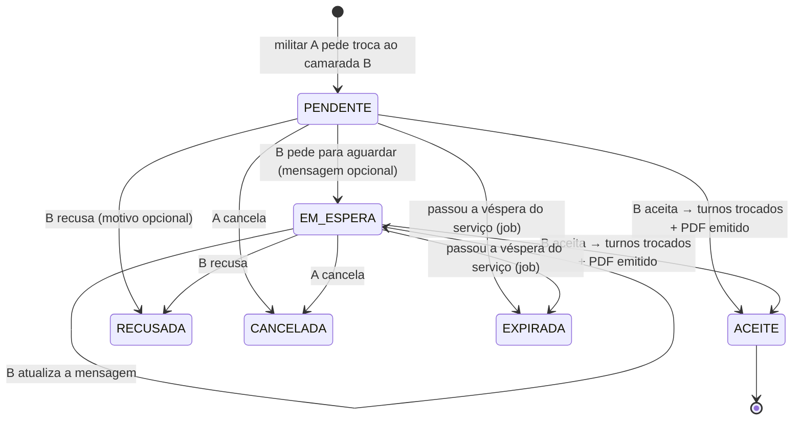
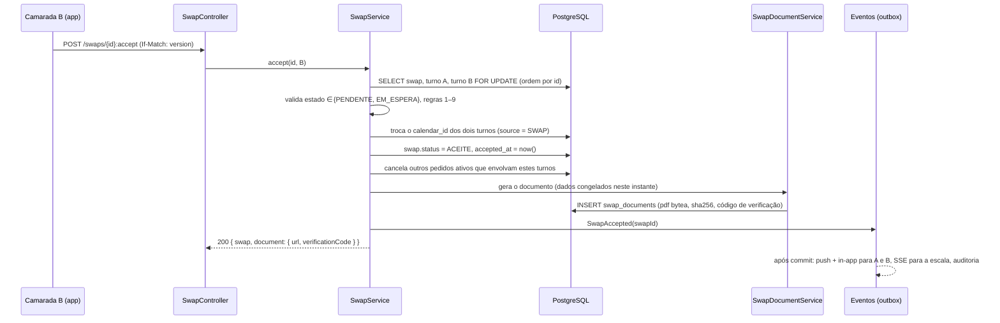

# 9. Trocas de serviço entre militares (sem autorização do comandante)

> Público-alvo: **militares da GNR**. Reaproveita o modelo de trocas e o documento oficial "Troca de Serviço"
> do EscalasPT (`swap_service.py`, `swap_pdf_service.py`), mas **elimina o papel do comandante e a aprovação dele**.
> A troca é um acordo entre dois camaradas da mesma escala: se o camarada aceita, a troca fica feita e o PDF é emitido
> nesse momento.

## 9.1 O que muda face ao EscalasPT

| EscalasPT (hoje) | Turnos (novo) |
|------------------|---------------|
| `PENDING_TARGET → PENDING_APPROVAL → APPROVED` | `PENDENTE → ACEITE` (o PDF é emitido logo) |
| O comandante/adjunto aprova ou rejeita (`decide_swap`) | **Não existe.** Não há papel de comandante nem endpoint de decisão |
| O camarada só pode aceitar ou recusar | O camarada pode **aceitar**, **pedir para aguardar** ou **recusar** |
| O PDF só existe depois da aprovação do comando | O PDF é emitido **automaticamente na aceitação** e fica disponível aos dois |
| No PDF, o registo digital tem "Autorização pelo Comandante" | Essa linha sai. Entram "Pedido para aguardar" (se houve) e um **código de verificação** |
| Os comandantes recebem a notificação "Troca Pendente de Aprovação" | Só os dois militares são notificados; a escala partilhada atualiza-se em tempo real |
| Âmbito: mesmo posto (`station_id`) | Âmbito: **mesma escala** (grupo), como exige o Art. 34.º, n.º 1 |

Mantém-se tudo o que já funcionava bem: as validações de tipos de serviço trocáveis, a deteção de conflitos, um só
pedido ativo por turno, o formulário oficial com a nota do RGSGNR, as notificações in-app e push, e a auditoria.

## 9.2 A escala (sem postos nem comandos)

Não volta a hierarquia Comando → Destacamento → Posto. A "escala" é um **grupo** (doc 03, `groups`) onde estão os camaradas
que trocam serviços entre si. Só ganha os campos que o documento oficial precisa:

| Campo novo em `groups` | Exemplo | Uso |
|------------------------|---------|-----|
| `unit_name` | `Posto Territorial de Castro Marim` | Cabeçalho do PDF |
| `location` | `Castro Marim` | "Quartel em Castro Marim, 26 de setembro de 2026" |

E o perfil do militar (`users`) ganha campos opcionais, pedidos só quando se entra numa escala GNR:

| Campo | Exemplo | Uso |
|-------|---------|-----|
| `rank` (posto) | `Guarda`, `Guarda Principal`, `Cabo`, `Cabo-Chefe`, `Sargento-Ajudante`… | Nome no PDF: "Guarda Principal Rui Almeida" |
| `service_number` (n.º de ordem) | `909` | Identificação no PDF e na escala |

O NIM **não** é pedido (minimização de dados, RGPD). Se o formulário oficial o vier a exigir, é um campo opcional
que se acrescenta sem mexer no fluxo.

Os papéis no grupo continuam a ser `OWNER/ADMIN/MEMBER`, mas servem **apenas** para gerir quem entra na escala.
Nenhum papel aprova trocas (`groups.swap_policy` fica fixo em `PEER_ONLY` nas escalas GNR).

## 9.3 Máquina de estados



| Estado | Significado | Quem age a seguir | Estado terminal |
|--------|-------------|-------------------|-----------------|
| `PENDENTE` | Pedido enviado, B ainda não respondeu | B (aceitar, aguardar, recusar) ou A (cancelar) | não |
| `EM_ESPERA` | B viu e pediu para aguardar ("vejo a minha vida e digo-te amanhã") | B (aceitar, recusar) ou A (cancelar) | não |
| `ACEITE` | Troca feita: os turnos mudaram de dono e o documento foi emitido | — | sim |
| `RECUSADA` | B recusou | — | sim |
| `CANCELADA` | A desistiu antes da resposta final | — | sim |
| `EXPIRADA` | Chegou o fim da véspera do serviço mais cedo sem resposta final | — | sim |

**"Aguardar" não é uma resposta final.** Serve para B dizer a A "não te esqueci", para A não ir pedir a outro camarada
à pressa, e aparece na cronologia do PDF se a troca vier a ser aceite. A pode, se quiser, cancelar e pedir a outro.

### Porque é que a expiração é na véspera

O Art. 34.º, n.º 2 do RGSGNR diz que os pedidos de troca são "solicitados até à véspera da execução". Por isso:

- **Criar um pedido** só é possível se o serviço mais cedo envolvido for **depois de hoje** (data local do calendário).
- **O pedido expira às 23:59 da véspera** desse serviço (`expires_at` calculado com o fuso do calendário).
  Um job do db-scheduler marca `EXPIRADA` e notifica os dois.
- **Aceitar** é validado de novo contra a mesma regra (não se aceita no próprio dia).

## 9.4 Regras de validação (herdadas do EscalasPT)

Aplicadas **ao criar** e **outra vez ao aceitar**, dentro da mesma transação que troca os turnos:

| # | Regra | Origem no EscalasPT | Severidade |
|---|-------|---------------------|------------|
| 1 | Os dois militares estão na mesma escala (grupo) e partilham nela o calendário | `station_id` igual | erro |
| 2 | O turno de A pertence a A; o de B pertence a B; A ≠ B | `create_swap` | erro |
| 3 | Só se trocam serviços (`kind = WORK`, incluindo GRAT) e folgas (`F`). Ausências (FER, CONV, MF, DIL, LIC…) não | `SWAPPABLE_ABSENCE_CODES` | erro |
| 4 | Não se troca com quem está no mesmo serviço, no mesmo dia | `create_swap` | erro |
| 5 | Um só pedido ativo (`PENDENTE`/`EM_ESPERA`) por turno, do lado de A e do lado de B | `dup` / `dup_tgt` | erro |
| 6 | Depois da troca, nenhum dos dois fica com sobreposição horária nem com dia inteiro em conflito | `validate_swap` | erro |
| 7 | Descanso mínimo entre serviços (configurável, 8 h por omissão, como no EscalasPT) | `check_minimum_rest` | aviso (não bloqueia; os dois veem-no antes de enviar/aceitar) |
| 8 | Pedido feito até à véspera do serviço mais cedo | **novo** (Art. 34.º, n.º 2) | erro |
| 9 | Os turnos não mudaram desde o pedido (`version`) | **novo** | erro → `409`, "O serviço foi alterado depois do pedido" |

As regras 3 e 4 deixam de estar escritas com códigos no código: passam a ler `shift_types.kind` e `shift_types.swappable`
(nova coluna booleana, `true` por omissão para WORK e OFF, `false` para ABSENCE). Assim, cada escala pode afinar
que tipos se trocam sem alterar o código.

## 9.5 Aceitação: uma transação, um documento



- **O PDF é gerado dentro da transação.** Se a geração falhar, a troca não fica feita (nada de trocas aceites sem documento).
  Gerar um formulário de uma página com OpenPDF leva poucos milissegundos, o que é aceitável dentro da transação.
- **O documento é imutável.** Guarda-se o PDF (`bytea`) e o seu SHA-256; os downloads servem sempre o mesmo ficheiro,
  mesmo que depois alguém mude o nome, o posto ou o turno.
- **O PDF chega aos dois de imediato.** Aparece como anexo no detalhe da troca, e a notificação push "Troca aceite" abre-o diretamente.

## 9.6 O documento (formulário oficial, sem autorização do comando)

Mantém-se o layout do `swap_pdf_service.py` (A4, cabeçalho "Ministério da Administração Interna / GUARDA NACIONAL
REPUBLICANA", título "TROCA DE SERVIÇO", declaração, "O DECLARANTE", "CONFIRMO A TROCA", nota com o Art. 34.º).
As alterações são estas:

| Secção | Antes | Depois |
|--------|-------|--------|
| Cabeçalho | `station_name` | `groups.unit_name` |
| Declaração | Nome | Posto + nome (+ n.º de ordem se preenchido), p. ex. "Guarda Principal Rui Almeida (n.º 812)" |
| "Quartel em …" | Derivado do nome do posto | `groups.location` + data da **aceitação** |
| Assinaturas | Nomes em itálico + linha | Iguais, com a indicação "Aceite digitalmente em 26/09/2026 14:32" por baixo de cada nome |
| Registo digital | Pedido · Aceitação pelo militar · **Autorização pelo Comandante** | Pedido · Pedido para aguardar (só se houve) · Aceitação pelo militar e emissão |
| Rodapé | `Ref. XXXXXXXX` | `Ref. XXXXXXXX` + **código de verificação** + QR para `https://turnos.pt/verificar/{código}` |
| Caixa "VISTO" | Presente | **Mantém-se em branco**: é parte do modelo oficial, mas a app não espera por ela nem a regista |

### Verificação de autenticidade

Como deixa de haver a assinatura do comando, a prova é o registo digital. O código de verificação (8 caracteres
Crockford Base32, gerados aleatoriamente e únicos) abre uma página pública mínima:

```
GET /api/v1/verify/{code}
→ 200 { "reference": "7F3K9Q2M", "issuedAt": "2026-09-26T13:32:05Z", "unit": "Posto Territorial de Castro Marim",
        "sha256": "…", "status": "VALID" }
```

- Mostra apenas a referência, a data, a unidade e o hash. **Não** mostra nomes nem serviços; quem tem o papel já os vê.
- Quem receber o PDF pode confirmar que o ficheiro não foi alterado comparando o SHA-256.
- Rate limit por IP. Os códigos não são sequenciais.

## 9.7 Notificações

| Evento | A (quem pede) | B (camarada) | Resto da escala |
|--------|---------------|--------------|-----------------|
| Pedido criado | — | Push + in-app: "Guarda Silva quer trocar o seu AT3 de sáb 3/10 pelo seu OC2" com ações **Aceitar · Aguardar · Recusar** | — |
| Aguardar | Push: "O Cabo Rocha pediu para aguardar: *vejo amanhã e digo-te*" | — | — |
| Aceite | Push: "Troca aceite, documento emitido" (abre o PDF) | Idem | A escala atualiza em tempo real (SSE `shifts.changed`), sem notificação |
| Recusada | Push com o motivo, se houver | — | — |
| Cancelada | — | In-app | — |
| Expirada | In-app | In-app | — |
| Lembrete | — | Push às 20:00 do dia anterior à expiração se ainda estiver `PENDENTE`/`EM_ESPERA` | — |

## 9.8 Alterações ao modelo de dados (doc 03)

```sql
-- groups: dados para o documento oficial
ALTER TABLE groups ADD COLUMN unit_name text;     -- "Posto Territorial de Castro Marim"
ALTER TABLE groups ADD COLUMN location  text;     -- "Castro Marim"

-- users: identificação militar opcional
ALTER TABLE users ADD COLUMN rank           text;   -- "Guarda Principal"
ALTER TABLE users ADD COLUMN service_number text;   -- n.º de ordem

-- shift_types: que tipos se podem trocar
ALTER TABLE shift_types ADD COLUMN swappable boolean NOT NULL DEFAULT true;

-- swap_requests: novos estados, sem aprovação
ALTER TABLE swap_requests DROP CONSTRAINT swap_requests_status_check;
ALTER TABLE swap_requests ADD CONSTRAINT swap_requests_status_check
    CHECK (status IN ('PENDENTE','EM_ESPERA','ACEITE','RECUSADA','CANCELADA','EXPIRADA'));
ALTER TABLE swap_requests
    DROP COLUMN decided_by,
    DROP COLUMN decided_at,
    ADD COLUMN hold_message  text CHECK (length(hold_message) <= 280),
    ADD COLUMN held_at       timestamptz,
    ADD COLUMN responded_at  timestamptz,
    ADD COLUMN decline_reason text CHECK (length(decline_reason) <= 280);
-- "um pedido ativo por turno", agora dos dois lados
DROP INDEX swap_one_active_per_shift;
CREATE UNIQUE INDEX swap_one_active_req ON swap_requests (requester_shift_id) WHERE status IN ('PENDENTE','EM_ESPERA');
CREATE UNIQUE INDEX swap_one_active_tgt ON swap_requests (target_shift_id)    WHERE status IN ('PENDENTE','EM_ESPERA');

-- documento emitido na aceitação (1:1, imutável)
CREATE TABLE swap_documents (
    swap_request_id   uuid PRIMARY KEY REFERENCES swap_requests(id) ON DELETE RESTRICT,
    reference         char(8) NOT NULL UNIQUE,         -- "Ref." no rodapé
    verification_code char(8) NOT NULL UNIQUE,         -- aleatório, Crockford Base32
    pdf               bytea   NOT NULL,
    sha256            bytea   NOT NULL,
    snapshot          jsonb   NOT NULL,                -- nomes, postos, serviços e horas tal como impressos
    issued_at         timestamptz NOT NULL DEFAULT now()
);
-- REVOKE UPDATE, DELETE ON swap_documents FROM turnos_app;
```

As ofertas abertas ao grupo (`kind = GIVEAWAY`, `swap_responses`) ficam **fora** das escalas GNR no MVP: o
Art. 34.º fala de trocas entre dois militares identificados.

## 9.9 API (substitui a secção "Trocas" do doc 04)

| Método | Path | Quem | Descrição |
|--------|------|------|-----------|
| POST | `/groups/{gid}/swaps` | A | `{shiftId, targetShiftId, message?}` → `201` com `warnings[]` (descanso) |
| GET | `/me/swaps?box=received\|sent\|history` | A ou B | Caixas de entrada |
| GET | `/swaps/{id}` | A, B | Detalhe com a pré-visualização do impacto nos dois calendários |
| POST | `/swaps/{id}:accept` | B | `If-Match` → `200 {swap, document}` |
| POST | `/swaps/{id}:hold` | B | `{message?}` → `EM_ESPERA` |
| POST | `/swaps/{id}:decline` | B | `{reason?}` → `RECUSADA` |
| POST | `/swaps/{id}:cancel` | A | → `CANCELADA` |
| GET | `/swaps/{id}/document.pdf` | A, B | O PDF emitido (`Content-Disposition: attachment; filename="troca-7F3K9Q2M.pdf"`) |
| GET | `/verify/{code}` | público | Verificação do documento (§9.6) |

Deixam de existir: `POST /swaps/{id}/decide`, `:approve`, `:reject` e a notificação aos comandantes.

## 9.10 Casos-limite

| Situação | Comportamento |
|----------|---------------|
| B aceita ao mesmo tempo que A cancela | Os dois fazem `SELECT … FOR UPDATE`; ganha quem chega primeiro, o outro recebe `409 swap-invalid-state` |
| A altera o turno depois de pedir | `version` muda → a aceitação dá `409` e o pedido passa a `CANCELADA` com o motivo "serviço alterado" |
| Dois pedidos diferentes chegam a B para o mesmo turno de B | O índice `swap_one_active_tgt` só deixa existir um; o segundo pedido recebe `422` "Esse serviço já tem um pedido de troca ativo" |
| B sai da escala com um pedido ativo | Os pedidos ativos dele passam a `CANCELADA` |
| Os militares querem desfazer uma troca aceite | Fazem uma **nova troca** no sentido inverso (novo documento). Um documento emitido nunca se apaga nem se altera |
| Troca de folga por serviço (F ↔ AT2) | Permitida, como hoje; o PDF indica "Folga" no lugar do serviço |
| Serviço noturno a atravessar a mudança de hora | Horas impressas com o fim real (doc 02, §2.6) |

## 9.11 Testes obrigatórios

- Máquina de estados: todas as transições válidas e **todas as inválidas** (tabela parametrizada estado × ação × ator).
- Concorrência: aceitar vs. cancelar em paralelo, e duas aceitações do mesmo turno por pedidos diferentes (duas threads,
  `CountDownLatch`) → exatamente uma `ACEITE` e um único documento.
- Véspera: pedido criado às 23:58 da antevéspera, expiração às 23:59:59 da véspera, aceitação rejeitada no próprio dia;
  com os fusos de Lisboa e dos Açores.
- PDF: o texto extraído (PDFBox) contém os nomes, os serviços, as horas, a data de aceitação e o código; **não** contém
  "Autorização pelo Comandante"; o SHA-256 guardado bate com o ficheiro servido.
- Autorização: só B pode aceitar/aguardar/recusar; só A pode cancelar; só A e B descarregam o PDF.
