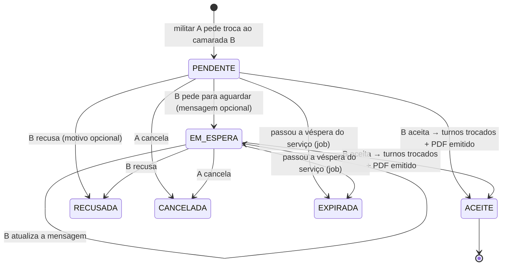
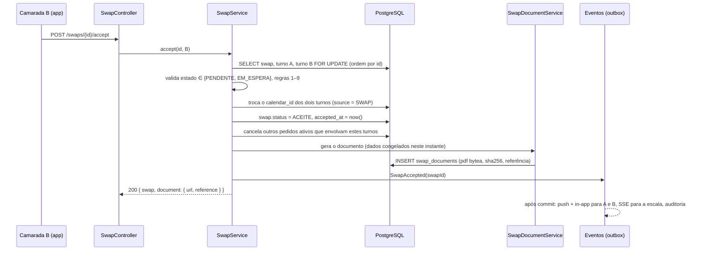

# 9. Trocas de serviço entre militares (sem autorização do comandante)

> Público-alvo: **militares da GNR**. Reaproveita o modelo de trocas e o documento oficial "Troca de Serviço"
> do EscalasPT (`swap_service.py`, `swap_pdf_service.py`), mas **elimina o papel do comandante e a aprovação dele**.
> A troca é um acordo entre dois camaradas da mesma escala: se o camarada aceita, a troca fica feita e o PDF é emitido
> nesse momento.

## 9.1 O que muda face ao EscalasPT

| EscalasPT (hoje) | Turnos (novo) |
|------------------|---------------|
| `PENDING_TARGET → PENDING_APPROVAL → APPROVED` | `PENDENTE → ACEITE` (o PDF é emitido logo) |
| O comandante/adjunto aprova ou rejeita (`decide_swap`) | **Não existe.** Não há papel de comandante nem endpoint de decisão |
| O camarada só pode aceitar ou recusar | O camarada pode **aceitar**, **pedir para aguardar** ou **recusar** |
| O PDF só existe depois da aprovação do comando | O PDF é emitido **automaticamente na aceitação** e fica disponível aos dois |
| No PDF, o registo digital tem "Autorização pelo Comandante" | Essa linha sai. O resto do documento fica **igual ao modelo oficial** |
| Os comandantes recebem a notificação "Troca Pendente de Aprovação" | Só os dois militares são notificados; a escala partilhada atualiza-se em tempo real |
| Âmbito: mesmo posto (`station_id`) | Âmbito: **a escala do posto** (qualquer militar do posto, de qualquer grupo de folgas), como exige o Art. 34.º, n.º 1 |

Mantém-se tudo o que já funcionava bem: as validações de tipos de serviço trocáveis, a deteção de conflitos, um só
pedido ativo por turno, o formulário oficial com a nota do RGSGNR, as notificações in-app e push, e a auditoria.

## 9.2 Escala do posto e grupos de folgas

Não volta a hierarquia Comando → Destacamento → Posto. Há dois níveis, ambos só para organizar a escala:

- **Posto** (`groups.kind = 'POSTO'`): a escala do posto, com todos os grupos de folgas. É o âmbito das trocas.
- **Grupo de folgas** (`groups.kind = 'GRUPO_FOLGAS'`, `parent_id` → posto): os militares que folgam em conjunto (§9.2.1).

Separador **Posto** na app:

| Vista | Conteúdo |
|-------|----------|
| Dia | Para o dia escolhido, cada serviço (AT1, AT2, … OC3, GRAT, INQ) com os militares nomeados e o grupo de cada um; depois quem está de folga e quem está ausente |
| Semana | Tabela militares × dias, com os militares agrupados por grupo de folgas e o total de militares de serviço em cada dia |

Tocar num militar abre a ficha dele; tocar num serviço futuro de um camarada abre o pedido de troca.

O posto só ganha os campos que o documento oficial precisa:

| Campo novo em `groups` (posto) | Exemplo | Uso |
|------------------------|---------|-----|
| `unit_name` | `Posto Territorial de Castro Marim` | Cabeçalho do PDF |
| `location` | `Castro Marim` | "Quartel em Castro Marim, 26 de setembro de 2026" |

E o perfil do militar (`users`) ganha campos opcionais, pedidos só quando se entra numa escala GNR:

| Campo | Exemplo | Uso |
|-------|---------|-----|
| `rank` (posto) | `Guarda`, `Guarda Principal`, `Cabo`, `Cabo-Chefe`, `Sargento-Ajudante`… | Nome no PDF: "Guarda Principal Rui Almeida" |
| `service_number` (n.º de ordem) | `909` | Identificação no PDF e na escala |

O NIM **não** é pedido (minimização de dados, RGPD). Se o formulário oficial o vier a exigir, é um campo opcional
que se acrescenta sem mexer no fluxo.

Os papéis no grupo continuam a ser `OWNER/ADMIN/MEMBER`, mas servem **apenas** para gerir quem entra na escala.
Nenhum papel aprova trocas (`groups.swap_policy` fica fixo em `PEER_ONLY` nas escalas GNR).

## 9.2.1 Grupo de folgas e comandante de grupo

A escala partilhada é o **grupo de folgas** (ex.: "Grupo 2" do PT Castro Marim): os militares que folgam em conjunto
e que precisam de ver o que cada um está a fazer.

| Papel | Pode | Não pode |
|-------|------|----------|
| **Comandante de grupo** (`OWNER`, rótulo "Comandante de grupo") | Convidar militares, revogar convites, remover militares, mudar nome/unidade do grupo, passar o comando a outro militar | Aprovar, recusar ou alterar trocas; editar os serviços de outros |
| **Militar** (`MEMBER`) | Ver os serviços, folgas e ausências de todos; pedir e responder a trocas; sair do grupo | Convidar ou remover |

**Entrada só por convite do comandante de grupo:**

1. O comandante de grupo convida por email (posto + nome + email) ou gera um **código de uso único** (`GF2-7K3Q`), válido 7 dias.
2. O militar recebe o convite (email, push se já tiver conta, ou código introduzido na app) e vê quem convidou, o grupo e a unidade.
3. Ao aceitar, **escolhe o calendário de serviço que partilha**. No grupo de folgas a partilha é sempre completa
   (serviços, folgas e ausências); as notas pessoais nunca são partilhadas.
4. O comandante de grupo vê o convite passar de "enviado" a "aceite" e o militar aparece na escala.

Remover um militar (ou ele sair) cancela os pedidos de troca ativos dele nesse grupo. As trocas já aceites e os documentos mantêm-se.

**Ver o que cada um está a fazer** (segmento "Agora" do separador Grupo):

| Grupo | Critério (hora local do calendário) |
|-------|-------------------------------------|
| De serviço agora | serviço `WORK` em curso, com hora de fim |
| Entra mais tarde | serviço `WORK` que ainda não começou hoje |
| Já saiu hoje | serviço `WORK` que já terminou |
| De folga | `F` ou sem serviço |
| Ausentes | `kind = ABSENCE` (férias, convalescença…) |

**Escala do grupo em calendário** (segmento "Escala"): mês com uma barra por militar em cada dia, na cor do serviço
(folga a cinzento, ausência às riscas). Uma fila de avatares no topo filtra um militar, e aí cada dia mostra o serviço dele.
Tocar num dia abre quem faz o quê nesse dia; tocar no serviço futuro de um camarada abre o pedido de troca.

Cada linha mostra também o serviço de amanhã. Tocar num militar abre a ficha dele (posto, n.º, hoje, serviços e folgas do mês,
próximos 14 dias) e, a partir de qualquer serviço futuro, pede-se a troca.

Alterações ao modelo e à API:

```sql
ALTER TABLE groups ADD COLUMN kind text NOT NULL DEFAULT 'GENERIC' CHECK (kind IN ('GENERIC','POSTO','GRUPO_FOLGAS'));
ALTER TABLE groups ADD COLUMN parent_id uuid REFERENCES groups(id) ON DELETE RESTRICT;  -- grupo de folgas → posto
-- GRUPO_FOLGAS: share_level forçado a DETAILS, swap_policy fixo em PEER_ONLY, convites só pelo OWNER
ALTER TABLE group_invites ADD COLUMN invitee_name text, ADD COLUMN invitee_rank text,
                          ADD COLUMN accepted_by uuid REFERENCES users(id) ON DELETE SET NULL, ADD COLUMN accepted_at timestamptz;
```

| Método | Path | Quem | Descrição |
|--------|------|------|-----------|
| POST | `/groups/{gid}/invites` | Comandante de grupo | `{rank, name, email}` ou `{type: CODE}` → convite de uso único, 7 dias |
| DELETE | `/groups/{gid}/invites/{id}` | Comandante de grupo | Revogar |
| POST | `/invites/{token}:accept` | Militar convidado | `{calendarId}` |
| DELETE | `/groups/{gid}/members/{userId}` | Comandante de grupo (ou o próprio, para sair) | Cancela as trocas ativas desse militar |
| POST | `/groups/{gid}/owner:transfer` | Comandante de grupo | Passa o comando de grupo |
| GET | `/groups/{gid}/now` | Membros | Estado atual de cada militar (tabela acima) |
| GET | `/groups/{gid}/members/{userId}/shifts?from&to` | Membros | Escala de um camarada (ficha do militar) |

## 9.3 Máquina de estados



| Estado | Significado | Quem age a seguir | Estado terminal |
|--------|-------------|-------------------|-----------------|
| `PENDENTE` | Pedido enviado, B ainda não respondeu | B (aceitar, aguardar, recusar) ou A (cancelar) | não |
| `EM_ESPERA` | B viu e pediu para aguardar ("vejo a minha vida e digo-te amanhã") | B (aceitar, recusar) ou A (cancelar) | não |
| `ACEITE` | Troca feita: os turnos mudaram de dono e o documento foi emitido | — | sim |
| `RECUSADA` | B recusou | — | sim |
| `CANCELADA` | A desistiu antes da resposta final | — | sim |
| `EXPIRADA` | Chegou o fim da véspera do serviço mais cedo sem resposta final | — | sim |

**"Aguardar" não é uma resposta final.** Serve para B dizer a A "não te esqueci", para A não ir pedir a outro camarada
à pressa, e aparece na cronologia do PDF se a troca vier a ser aceite. A pode, se quiser, cancelar e pedir a outro.

### Porque é que a expiração é na véspera

O Art. 34.º, n.º 2 do RGSGNR diz que os pedidos de troca são "solicitados até à véspera da execução". Por isso:

- **Criar um pedido** só é possível se o serviço mais cedo envolvido for **depois de hoje** (data local do calendário).
- **O pedido expira às 23:59 da véspera** desse serviço (`expires_at` calculado com o fuso do calendário).
  Um job do db-scheduler marca `EXPIRADA` e notifica os dois.
- **Aceitar** é validado de novo contra a mesma regra (não se aceita no próprio dia).

## 9.4 Regras de validação (herdadas do EscalasPT)

Aplicadas **ao criar** e **outra vez ao aceitar**, dentro da mesma transação que troca os turnos:

| # | Regra | Origem no EscalasPT | Severidade |
|---|-------|---------------------|------------|
| 1 | Os dois militares pertencem ao mesmo posto (qualquer grupo de folgas) | `station_id` igual | erro |
| 2 | O turno de A pertence a A; o de B pertence a B; A ≠ B | `create_swap` | erro |
| 3 | Só se trocam serviços (`kind = WORK`, incluindo GRAT) e folgas (`F`). Ausências (FER, CONV, MF, DIL, LIC…) não | `SWAPPABLE_ABSENCE_CODES` | erro |
| 4 | Não se troca com quem está no mesmo serviço, no mesmo dia | `create_swap` | erro |
| 5 | Um só pedido ativo (`PENDENTE`/`EM_ESPERA`) por turno, do lado de A e do lado de B | `dup` / `dup_tgt` | erro |
| 6 | Depois da troca, nenhum dos dois fica com sobreposição horária nem com dia inteiro em conflito | `validate_swap` | erro |
| 7 | Descanso mínimo entre serviços (configurável, 8 h por omissão, como no EscalasPT) | `check_minimum_rest` | aviso (não bloqueia; os dois veem-no antes de enviar/aceitar) |
| 8 | Pedido feito até à véspera do serviço mais cedo | **novo** (Art. 34.º, n.º 2) | erro |
| 9 | Os turnos não mudaram desde o pedido (`version`) | **novo** | erro → `409`, "O serviço foi alterado depois do pedido" |

As regras 3 e 4 deixam de estar escritas com códigos no código: passam a ler `shift_types.kind` e `shift_types.swappable`
(nova coluna booleana, `true` por omissão para WORK e OFF, `false` para ABSENCE). Assim, cada escala pode afinar
que tipos se trocam sem alterar o código.

## 9.5 Aceitação: uma transação, um documento



- **O PDF é gerado dentro da transação.** Se a geração falhar, a troca não fica feita (nada de trocas aceites sem documento).
  Gerar um formulário de uma página com OpenPDF leva poucos milissegundos, o que é aceitável dentro da transação.
- **O documento é imutável.** Guarda-se o PDF (`bytea`) e o seu SHA-256; os downloads servem sempre o mesmo ficheiro,
  mesmo que depois alguém mude o nome, o posto ou o turno.
- **O PDF chega aos dois de imediato.** Aparece como anexo no detalhe da troca, e a notificação push "Troca aceite" abre-o diretamente.

## 9.6 O documento (igual ao modelo oficial)

O PDF é o formulário "Troca de Serviço" tal como o `swap_pdf_service.py` já o gera: mesma página A4, margens (2,5 cm laterais,
2 cm em cima e em baixo), Helvetica, tamanhos de letra, textos e ordem das secções:

1. "Ministério da Administração Interna / GUARDA NACIONAL REPUBLICANA"
2. Nome do posto à esquerda e caixa "VISTO" à direita
3. "TROCA DE SERVIÇO"
4. "Declaro que desejo efectuar uma troca de serviço de ___ no dia ___, no horário compreendido entre as ___ e as ___, com o/a ___,
   que se encontra de serviço de ___, no horário compreendido entre as ___ e as ___."
5. "Quartel em ___, __ de ___ de ____"
6. "O DECLARANTE" (quem pediu) e "CONFIRMO A TROCA" (quem aceitou), cada um com o nome em itálico e a linha de assinatura
7. "REGISTO DIGITAL" com as datas no formato `dd/mm/aaaa às hh:mm`
8. "NOTA:" com o Art. 34.º do RGSGNR (n.ºs 1, 2 e 5, alíneas c e d), com o mesmo texto
9. Rodapé: "Processado por computador · Guarda Nacional Republicana · Ref. XXXXXXXX · Página 1 de 1"

**A única diferença** é a linha "Autorização pelo Comandante", que sai do registo digital.

Tal como o gerado pelo EscalasPT, o formulário ocupa duas páginas (a NOTA passa para a segunda). O EscalasPT escrevia
sempre "Página 1 de 1" no rodapé; aqui o rodapé indica a página real ("Página 2 de 2"). Ficam "Pedido de troca" e
"Aceitação pelo militar". Não se acrescenta mais nada ao papel: nem mensagens, nem "aguardar", nem QR.
A caixa "VISTO" fica como no modelo.

O nome impresso é o posto e o nome completo do militar ("Guarda Ana Silva"), como o `full_name` no EscalasPT.
"Quartel em" usa `groups.location` do posto, e a data é a da aceitação.

**Autenticidade** (fora do papel): o sistema guarda o PDF e o SHA-256 dele em `swap_documents`. Pela referência do rodapé,
os dois militares podem voltar a descarregar exatamente o mesmo ficheiro; um PDF alterado não tem o mesmo hash.

## 9.7 Notificações

| Evento | A (quem pede) | B (camarada) | Resto da escala |
|--------|---------------|--------------|-----------------|
| Pedido criado | — | Push + in-app: "Guarda Silva quer trocar o seu AT3 de sáb 3/10 pelo seu OC2" com ações **Aceitar · Aguardar · Recusar** | — |
| Aguardar | Push: "O Cabo Rocha pediu para aguardar: *vejo amanhã e digo-te*" | — | — |
| Aceite | Push: "Troca aceite, documento emitido" (abre o PDF) | Idem | A escala atualiza em tempo real (SSE `shifts.changed`), sem notificação |
| Recusada | Push com o motivo, se houver | — | — |
| Cancelada | — | In-app | — |
| Expirada | In-app | In-app | — |
| Lembrete | — | Push às 20:00 do dia anterior à expiração se ainda estiver `PENDENTE`/`EM_ESPERA` | — |

## 9.8 Alterações ao modelo de dados (doc 03)

```sql
-- groups: dados para o documento oficial
ALTER TABLE groups ADD COLUMN unit_name text;     -- "Posto Territorial de Castro Marim"
ALTER TABLE groups ADD COLUMN location  text;     -- "Castro Marim"

-- users: identificação militar opcional
ALTER TABLE users ADD COLUMN rank           text;   -- "Guarda Principal"
ALTER TABLE users ADD COLUMN service_number text;   -- n.º de ordem

-- shift_types: que tipos se podem trocar
ALTER TABLE shift_types ADD COLUMN swappable boolean NOT NULL DEFAULT true;

-- swap_requests: novos estados, sem aprovação
ALTER TABLE swap_requests DROP CONSTRAINT swap_requests_status_check;
ALTER TABLE swap_requests ADD CONSTRAINT swap_requests_status_check
    CHECK (status IN ('PENDENTE','EM_ESPERA','ACEITE','RECUSADA','CANCELADA','EXPIRADA'));
ALTER TABLE swap_requests
    DROP COLUMN decided_by,
    DROP COLUMN decided_at,
    ADD COLUMN hold_message  text CHECK (length(hold_message) <= 280),
    ADD COLUMN held_at       timestamptz,
    ADD COLUMN responded_at  timestamptz,
    ADD COLUMN decline_reason text CHECK (length(decline_reason) <= 280);
-- "um pedido ativo por turno", agora dos dois lados
DROP INDEX swap_one_active_per_shift;
CREATE UNIQUE INDEX swap_one_active_req ON swap_requests (requester_shift_id) WHERE status IN ('PENDENTE','EM_ESPERA');
CREATE UNIQUE INDEX swap_one_active_tgt ON swap_requests (target_shift_id)    WHERE status IN ('PENDENTE','EM_ESPERA');

-- documento emitido na aceitação (1:1, imutável)
CREATE TABLE swap_documents (
    swap_request_id   uuid PRIMARY KEY REFERENCES swap_requests(id) ON DELETE RESTRICT,
    reference         char(8) NOT NULL UNIQUE,         -- "Ref." no rodapé
    pdf               bytea   NOT NULL,
    sha256            bytea   NOT NULL,
    snapshot          jsonb   NOT NULL,                -- nomes, postos, serviços e horas tal como impressos
    issued_at         timestamptz NOT NULL DEFAULT now()
);
-- REVOKE UPDATE, DELETE ON swap_documents FROM turnos_app;
```

As ofertas abertas ao grupo (`kind = GIVEAWAY`, `swap_responses`) ficam **fora** das escalas GNR no MVP: o
Art. 34.º fala de trocas entre dois militares identificados.

## 9.9 API (substitui a secção "Trocas" do doc 04)

| Método | Path | Quem | Descrição |
|--------|------|------|-----------|
| POST | `/swaps` | A | `{shiftId, targetShiftId, message?}` → `201` com `warnings[]` (descanso) |
| GET | `/me/swaps?box=received\|sent\|history` | A ou B | Caixas de entrada |
| GET | `/swaps/{id}` | A, B | Detalhe com a pré-visualização do impacto nos dois calendários |
| POST | `/swaps/{id}/accept` | B | `If-Match` → `200 {swap, document}` |
| POST | `/swaps/{id}/hold` | B | `{message?}` → `EM_ESPERA` |
| POST | `/swaps/{id}/decline` | B | `{reason?}` → `RECUSADA` |
| POST | `/swaps/{id}/cancel` | A | → `CANCELADA` |
| GET | `/swaps/{id}/document.pdf` | A, B | O PDF emitido (`Content-Disposition: attachment; filename="troca-7F3K9Q2M.pdf"`) |

Deixam de existir: `POST /swaps/{id}/decide`, `:approve`, `:reject` e a notificação aos comandantes.

## 9.10 Casos-limite

| Situação | Comportamento |
|----------|---------------|
| B aceita ao mesmo tempo que A cancela | Os dois fazem `SELECT … FOR UPDATE`; ganha quem chega primeiro, o outro recebe `409 swap-invalid-state` |
| A altera o turno depois de pedir | `version` muda → a aceitação dá `409` e o pedido passa a `CANCELADA` com o motivo "serviço alterado" |
| Dois pedidos diferentes chegam a B para o mesmo turno de B | O índice `swap_one_active_tgt` só deixa existir um; o segundo pedido recebe `422` "Esse serviço já tem um pedido de troca ativo" |
| B sai da escala com um pedido ativo | Os pedidos ativos dele passam a `CANCELADA` |
| Os militares querem desfazer uma troca aceite | Fazem uma **nova troca** no sentido inverso (novo documento). Um documento emitido nunca se apaga nem se altera |
| Troca de folga por serviço (F ↔ AT2) | Permitida, como hoje; o PDF indica "Folga" no lugar do serviço |
| Serviço noturno a atravessar a mudança de hora | Horas impressas com o fim real (doc 02, §2.6) |

## 9.11 Testes obrigatórios

- Máquina de estados: todas as transições válidas e **todas as inválidas** (tabela parametrizada estado × ação × ator).
- Concorrência: aceitar vs. cancelar em paralelo, e duas aceitações do mesmo turno por pedidos diferentes (duas threads,
  `CountDownLatch`) → exatamente uma `ACEITE` e um único documento.
- Véspera: pedido criado às 23:58 da antevéspera, expiração às 23:59:59 da véspera, aceitação rejeitada no próprio dia;
  com os fusos de Lisboa e dos Açores.
- PDF: teste *golden* que compara o texto extraído (PDFBox) com o do formulário gerado pelo EscalasPT para os mesmos dados;
  a única diferença admitida é a ausência da linha "Autorização pelo Comandante". O SHA-256 guardado bate com o ficheiro servido.
- Autorização: só B pode aceitar/aguardar/recusar; só A pode cancelar; só A e B descarregam o PDF.
